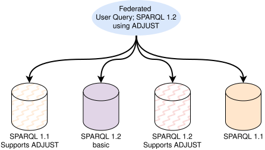

## Introduction
{:#introduction}

<!--
Talk about generation, modularity, you can refer to self about parsers but say that we have gone much more broad now.
We support round-tripping, generation, and algebra transformation.
Additional pro for in language parser builder is the variation your get from the type system.
Round-tripping allows you to make language tools such as linters.
AST transformer.
Why JS/ TS?
Modularity allows future proofness.
Why is do you see this issue in sparql? separation between the data model and query language?
What parsers do we support ourselves? Link to the proof of extension we did in Comunica?
-->

<!-- Intro to the problem of SPARQL heterogeneity -->
The [SPARQL query language](cite:cites spec:sparqllang) is the standard way to query [RDF](cite:cites spec:rdf) data.
While [SPARQL endpoints](cite:cites spec:sparqlprot) are commonly used to expose Knowledge Graphs through a highly expressive query API,
[alternative APIs have been proposed](cite:cites tpf,smartkg,sage,wisekg,brtpf,passage) that offer different trade-offs between client and server effort for query execution.
This heterogeneity in server APIs introduces challenges when executing [federated SPARQL queries](cite:cites spec:sparqlfed,fedx,hibiscus,splendid,hanski_wikidata_federation_2025) over multiple of these APIs.
While this API-based heterogeneity has been [an active field of research](cite:cites comunica,heterogeneous_lars,heterogeneous_fedqpl,heterogeneous_replicas) in recent years,
the heterogeneity of the SPARQL language itself lacks understanding.
In practice, [many SPARQL dialects exist](cite:cites geosparql,tsparql,csparql,rdfversioningquerylang) each introducing their own extensions or limitations.
Virtuoso, for example, extends SPARQL with full-text search capabilities ,
Apache Jena adds support for constructing quads ,
and Oxigraph provides an additional built-in function, `ADJUST` .
Furthermore, some SPARQL endpoints might limit the SPARQL language
by removing expensive operators such as OPTIONAL .
In the near future, this heterogeneity is expected to increase even further as the RDF and SPARQL W3C Working Group enters its
[maintenance mode](https://github.com/w3c/sparql-dev/issues/32#issuecomment-2621209920) ,
which could deliver more rapid successions of SPARQL once SPARQL 1.2 is finalized.
<!-- -->
As a result, the growing diversity of SPARQL versions and dialects introduces several challenges:

1. **Query evaluation**: A user query written in one version might not be executable by a SPARQL engine supporting another version.
2. **Tooling**: Linters, formatters, and editors often assume a specific SPARQL version.
3. **Maintainability**: Tools that support multiple SPARQL versions typically do so by maintaining multiple software versions,
   or one version with many conditions, making maintainability highly challenging.

<figure id="federation">

<figcaption markdown="block">
The federated SPARQL query (blue) uses SPARQL 1.2 features such as triple terms and uses the [non-standard builtin function ADJUST](cite:cites sparql-adjust).
The query targets four SPARQL endpoints, all supporting different SPARQL version, [RDF profiles](cite:cites rdf-1-2), and language extensions.
To allow query engines to integrate this heterogeneity,
frameworks such as Traqula are necessary to bridge between these SPARQL dialects.
</figcaption>
</figure>

<!-- federation in heterogeneous ecosystem is a problem - and RDFs distributed nature highlights this problem -->
The query evaluation problem within a heterogeneous SPARQL ecosystem becomes especially visible in federated SPARQL query execution.
While language dialects are common in many technologies, [SQL](cite:cites iso-sql) being a well-known example,
the [RDF data model](cite:cites spec:rdf) is explicitly designed for seamless integration of distributed datasets.
SPARQL reflects this distributed nature through support for federated queries,
where a single query may involve multiple endpoints, each with its own capabilities, limitations, and language features.

In such a setting, a SPARQL query written in one SPARQL version or dialect may not be executable on all federation members.
For instance, a query formulated in SPARQL 1.2 might rely on features, functions,
or syntactic constructs that an older endpoint does not support, or that are only available as vendor-specific extensions.
 illustrates this scenario; a query is written in SPARQL 1.2 and uses the non-standard [ADJUST function](cite:cites sparql-adjust),
yet the endpoints differ in their supported SPARQL versions,
[RDF profiles](cite:cites rdf-1-2), and feature sets.
Although the [SPARQL Service Description specification](cite:cites spec:sparqlservicedesc) allows endpoints to declare their supported features,
it does not offer mitigation paths to resolve these language mismatches.
To solve this problem, there is a need for a parsing, transformation, and generation framework such as Traqula that can handle various SPARQL dialects.
Such a framework provides a foundation for future SPARQL federation research towards new techniques and algorithms to manage these dialects.

<!-- We have done previous work, but we need to extend upon it + explain how we extended it -->
In [prior work](cite:cites modular-parsing),
we introduced our vision of a modular SPARQL parser to address the growing heterogeneity of SPARQL dialects using
builder-based [dependency injection](cite:cites fowler-dep-inj).
We envisioned a design with a prototype implementation demonstrating parser composability,
showing how grammar modules could be combined to modularly define multiple SPARQL parsers covering different versions and dialects.
In this article, we fully realize that vision with a complete implementation
as well as applying the modular architecture to query generation and transformation.
These features allow queries to be parsed, transformed, and regenerated reliably, while preserving their structure and semantics across different dialects.

<!-- Wrap up -->
This article presents Traqula, a modular SPARQL toolkit implementing these ideas.
Traqula has already been integrated into the widely used [Comunica SPARQL querying framework](cite:cites comunica), demonstrating its maturity and practical applicability. 
Traqula's modular and composable architecture enables researchers and practitioners to:
<!-- -->
1. Experiment with grammar changes, including adding, modifying, or removing rules;
2. tackle the complexities of federated SPARQL querying in a heterogeneous SPARQL ecosystem; and
3. lay the foundation for future query formatting and rewriting tools.
<!-- -->
Traqula is implemented in TypeScript and is available as open-source software under the MIT license on
[GitHub](https://github.com/comunica/traqula) and npm,
providing the community with a robust and flexible resource for building tools and engines for a heterogeneous SPARQL environment.

<!-- Structure explained -->
The remainder of this paper is structured as follows.
 details the requirements of Traqula,  reviews related work,
 presents the high-level architecture of Traqula,
and  discusses its implementation.
 evaluates its performance, and  concludes the paper.

