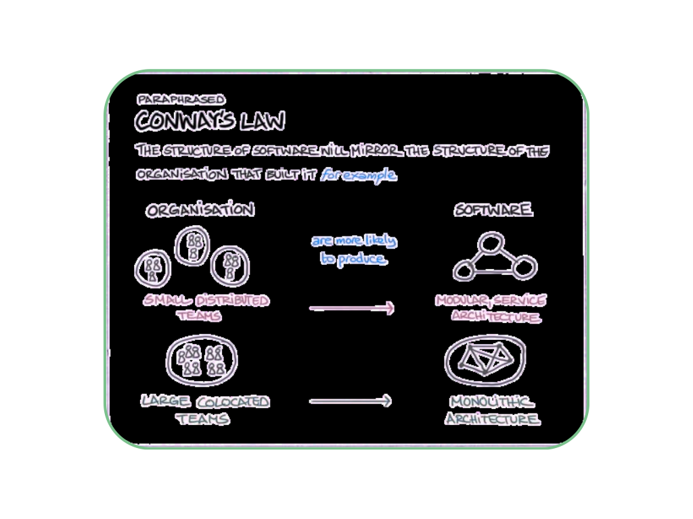
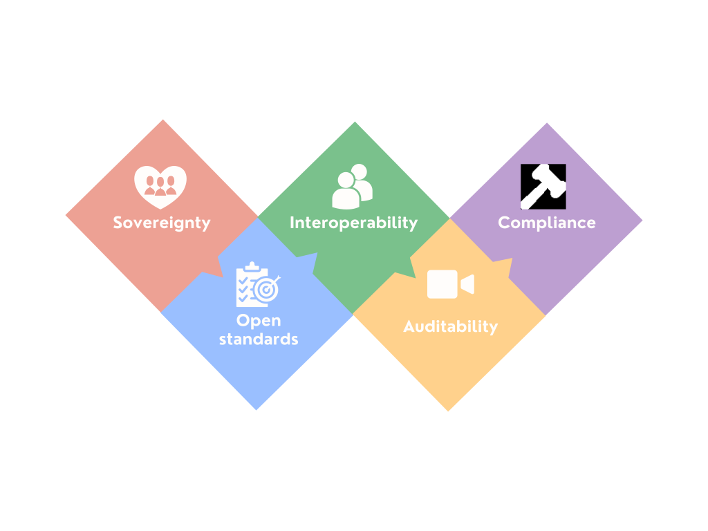
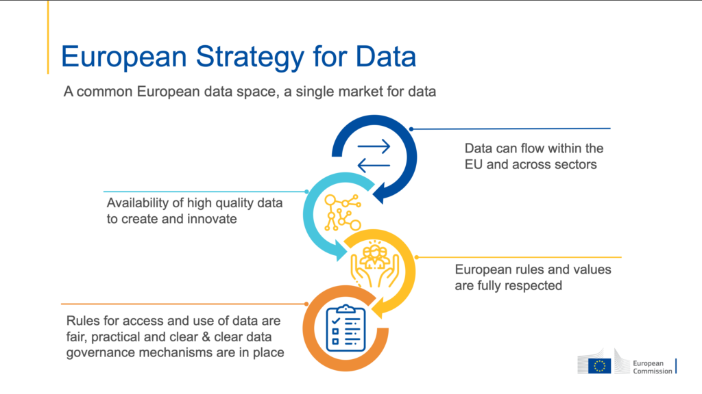

## Literature Study

The central research question of this thesis asks which design decisions are required when building media behaviour profiles across multiple services in a user-centric way. Answering this question requires a clear understanding of what such profiles are, why current approaches fall short, and which technologies and architectural principles can support a more user-centric solution. The sections that follow first define media behaviour data and examine its privacy implications, then establish the core principles of a user-centric architecture, introduce the Solid ecosystem as a technical foundation, describe the individual architectural building blocks in detail, and finally situate the proposed approach within the broader European data space landscape while reflecting on the stakeholders it affects and the limitations it inherits.

### Media Behaviour Profiles: Definition and Privacy Implications
In this thesis, media behaviour profiles refers to profiles created when a user interacts with a media platform. This includes direct actions, such as playing a video, pausing content, skipping a song, or entering a search query. It also includes patterns derived from these actions over time, such as favourite genres, typical moments of use, or preferences across different platforms.

This distinction is important because raw events and derived profiles are not the same. A single play, pause, or search action may seem harmless, but when many of these events are combined, they can reveal detailed information about a person. For example, long-term media behaviour may expose routines, interests, political views, emotional states, health-related concerns, or cultural identity. This is often referred to as the mosaic effect: separate pieces of data may appear insignificant, but together they can form a sensitive and revealing profile.

A well-known example outside the media domain is Target’s reported use of shopping data to predict whether customers were pregnant and to target them with related advertisements [6]. Similar risks exist in media environments. Viewing history, listening behaviour, and search activity can reveal sensitive personal information, even when the original data appears ordinary. Media behaviour data should not be treated as low-risk simply because individual events seem harmless.
The privacy risk is increased by the fact that most media platforms store this data centrally. Platforms often collect, analyse, and retain behavioural data within their own infrastructure, while users have limited insight into what is stored, how long it is kept, how it is used, or with whom it is shared. This creates an imbalance: platforms can build detailed profiles of users, while users have little control over those profiles. In this context, user control means more than the ability to access or delete data. It includes the ability to determine where data is stored, which actors may access it, for which purposes it may be used, how long it may be retained, and whether derived profiles may be shared with others 

Centralised storage can also create security and governance risks. Large behavioural datasets may become attractive targets for breaches, legal requests, and secondary uses beyond the user’s original expectations. Once behavioural data has been used to train models or create derived profiles, it may also be difficult to fully remove its influence, even if the original data is deleted. This creates tension with rights such as data erasure under the GDPR [8].

However, decentralised storage does not automatically remove these risks. When data is distributed across multiple pods, services, or intermediaries, security responsibility also becomes more distributed. This may make it harder to secure every storage location, client application, and access path consistently. The relevant design question is therefore not whether centralised or decentralised storage is inherently safer, but which architecture gives users more meaningful control over storage, access, usage conditions, and accountability.

### Towards a User-Centric Architecture: Core Principles
<!-- PC:  I’m not sure whether this chapter fits within the literature study: it introduces key terms. Maybe this fits better in the introduction? -->

A user-centric media profile architecture inverts the traditional platform-controlled model. Instead of each platform storing and governing user data independently, the user maintains their data in a personal data store. Platforms may only access or contribute to this data with explicit user consent, for a clearly defined purpose, and within a specified time frame. This introduces several requirements that guide the design choices discussed in this thesis.

**Sovereignty** is a foundational principle in the European data landscape, ensuring that individuals or organisations retain full control over the data they generate. Without sovereignty as an explicit design constraint, any user-centric system risks becoming another form of delegated control, where users technically have access to their data but lack the practical means to govern it.

**Interoperability and Open Standards** are equally important. Just as the internet depends on shared protocols such as HTTP, HTML, and URLs, user-centric systems need common standards so that independent services can exchange and interpret data. This idea is closely related to the principles discussed in the UGent micro-credential on Knowledge Graphs, where interoperability is treated as a central principle for connecting distributed data sources. Conway’s Law illustrates why this matters: system design often mirrors the communication structures of the organisations that create it [7].Without deliberate working towards interoperability, data silos are likely to remain as a natural consequence of organisational boundaries, directly limiting the possibility of cross-service interoperability.

<figure id="fig-conways-law">

<figcaption markdown="block">
Organisational structure tends to mirror system design.
</figcaption>
</figure>

**Compliance** in a decentralised ecosystem cannot be implemented solely through the internal governance of one platform, because media behaviour data may involve several independent actors, including media services, pod providers, aggregation agents, application developers, and data consumers. Each actor may control only part of the data flow. As a result, compliance requires more than one organisation enforcing its own rules. It depends on shared policies, interoperable technical standards, verification mechanisms, contractual agreements, and alignment with regulatory requirements such as the GDPR [8].

Gaia-X is relevant in this context because it approaches trusted data sharing as a federated governance problem. Its Digital Clearing House concept provides verification mechanisms that can check whether participants and services comply with Gaia-X rules before they take part in data exchange [5]. This illustrates how decentralised or federated data ecosystems may require trusted verification services to support accountability across organisational boundaries. For this thesis, Gaia-X is therefore useful not as a direct replacement for Solid, but as an example of how broader data-space initiatives address trust, compliance, and interoperability at an ecosystem level.

**Auditability** follows directly from the compliance requirement: relevant data access and usage events should be traceable and verifiable when accountability, compliance, or dispute resolution requires it. Without transparent records of who accessed sensitive behavioural data, when access occurred, and for which stated purpose, it becomes difficult to detect misuse or demonstrate that data was handled according to agreed policies.

<figure id="fig-key-principles">

<figcaption markdown="block">
Key principles of a user-centric media profile architecture.
</figcaption>
</figure>

### The Solid Ecosystem as a Technical Foundation

<!-- This is pretty good - would love to see what references you point at here though -->

> "When I invented the World Wide Web, I envisioned technology that would empower people and enable collaboration… Solid returns the web to its roots by giving everyone direct control over their own data."
> - Sir Tim Berners-Lee [9]

The Solid initiative provides a concrete technological foundation for user-centric data management [10]. Its central concept is the **data pod** (or data vault), a decentralised storage space where individuals manage their own information independently of any platform. Users determine who can access their data, for what purpose, and for how long, directly supporting the principle of data **sovereignty** by shifting control away from what we call centralised intermediaries.

Technically, a Solid pod is an HTTP-accessible storage container that exposes its contents as Linked Data resources. Each resource is addressable by a URI and can be retrieved, updated, or deleted through standard HTTP verbs, which means that a pod is, in essence, a personal **slice** of the web that the user controls. Data inside a pod is typically represented in RDF(Resource Description Framework). RDF is a standard model for describing data as relationships between things. Instead of storing information in isolated tables or application-specific formats, RDF represents data in simple statements, called triples: a subject, a predicate, and an object. For example, a media event could state that a user played a specific song at a specific time. Because each part of the statement can be identified using a URI, different applications can refer to the same concepts in a consistent way.

RDF data can be serialised in formats such as Turtle or JSON-LD. Turtle is compact and commonly used in Linked Data environments, while JSON-LD is easier to integrate with web applications that already use JSON. Other types of resources, such as images or audio files, can also be stored in a pod.

RDF is useful because it supports semantic interoperability. This means that data written by one application can be understood by another, as long as both applications use the same vocabulary or can map between different vocabularies. For media behaviour data, this is especially relevant. A video platform and a music platform may generate different kinds of interaction events, but RDF makes it possible to describe those events in a shared structure. For example, both a watched video and a played song can be represented as media interactions with a timestamp, a content item, and a user action, using vocabularies such as schema.org or domain-specific ontologies.

Solid defines two main access control mechanisms. **Web Access Control (WAC)** is the older and more widely implemented model. It works in a way that is similar to file permissions: users, groups, applications, and resources are identified by URIs, and permissions are attached to specific resources or containers [11]. These permissions usually define whether an actor can read, write, append to, or control a resource.

WAC is relatively simple, which makes it easy to understand and implement. However, this simplicity also limits what it can express. For example, WAC is not well suited for more specific conditions such as “only allow access for personalisation” or “only allow access for a limited period of time.”

Access Control Policies (ACP) provide a more flexible alternative [12]. ACP allows access rules to be expressed in a more detailed way, including conditions about which user, application, or context is involved. This makes ACP more suitable for systems where access should depend not only on who is requesting the data, but also on why and under which conditions the data is being accessed.

Both WAC and ACP support an important Solid principle: access control should not be hidden inside each individual application. Instead of allowing every media platform to decide for itself what it can do with user data, access rules are linked directly to the user’s resources in the pod. For example, a user can decide that a music service may read their listening history, while another service may only access an aggregated profile. This makes the data less dependent on the internal policies of one platform and supports a more user-centric form of data governance.

However, this does not mean that the pod host is completely irrelevant. The server still enforces the access rules, which means that the hosting provider remains part of the trusted infrastructure. Nevertheless, Solid improves on traditional platform-controlled models because access policies are defined around the user’s data and can, in principle, move with the pod if the user changes provider.

Authentication is handled through **Solid-OIDC** [13], which builds on the widely adopted OAuth 2.0 and OpenID Connect standards. Users are identified through a **WebID** [14], a globally unique, user-controlled URI, enabling identity verification across services. The WebID is typically hosted within the user's own pod, which means that the user's identity document is itself a piece of data they control, and can be updated, extended, or moved without requiring the cooperation of any identity provider.

For deployment within the European context, the Community Solid Server (CSS), developed by imec and Ghent University, offers a ready and open-source implementation of the Solid specifications [15]. CSS is modular by design, with configurable components for storage backends, authentication flows, and access control mechanisms. This makes it useful for research prototypes and experimental deployments where different architectural choices need to be tested. However, CSS should not be treated as a fully mature production platform without further evaluation. For this thesis, its main value lies in its flexibility: components such as policy enforcement, aggregation, or custom access-control behaviour can be explored through extensions or configuration, without requiring changes to the whole server architecture.

While Solid provides a useful foundation for user-controlled storage and access control, it does not solve every governance problem on its own. Access control mainly answers the question: “Is this agent allowed to access this resource?” However, it does not fully answer questions such as: “For which purpose may the data be used?”, “How long may it be retained?”, or “Can it be shared with others?” These questions are especially important for media behaviour profiles, because the sensitivity of the data depends not only on who accesses it, but also on how it is used. Therefore, additional mechanisms are needed for policy enforcement, cross-service aggregation, auditability, and legal compliance. These are discussed in the following sections.

### Architectural Building Blocks

The previous section introduced Solid as a technical foundation for user-controlled data storage and access management. This section translates those concepts into the main architectural building blocks required for media behaviour profiles across multiple services. These building blocks are data storage, identity and authentication, policy enforcement, aggregation, and auditability.

#### Data Storage and the Solid Pod

In the proposed architecture, the Solid pod acts as the main storage location for media behaviour data. Instead of keeping all behavioural data inside separate platform-controlled databases, services can write permitted data to the user’s pod. This supports data minimisation, because platforms only need access to the data that is relevant for a specific purpose.

For media behaviour data, the pod can be organised into separate containers. One container may store raw interaction events, such as plays, pauses, skips, and searches. Another container may store summaries for individual services, such as listening trends from a music platform. A third container may store the aggregated cross-service profile.

This separation is important because not all data has the same sensitivity. Raw interaction events can reveal detailed behavioural patterns, while aggregated profiles may provide useful insights with less exposure of the underlying data. By storing these data types separately, different access rules can be applied to each container. For example, a music service may be allowed to append new listening events, while a recommendation service may only read the aggregated profile.

This structure gives users more control over which services can contribute data, which services can read data, and which parts of the profile remain private. However, this control still depends on the correct implementation of the pod server, the access-control mechanism, and the surrounding policy layer.

For high-volume media behaviour data, the choice of Solid server implementation also matters. The Community Solid Server is useful for prototyping and experimental deployments, while newer implementations such as Kvasir explore more scalable, cloud-native approaches for data-intensive Solid applications [16]. This is relevant because media behaviour data may be generated continuously, creating stronger performance and storage requirements than more static personal data.

#### Identity and Authentication

A shared identity mechanism is needed so that data from different services can be linked to the correct user. In Solid, this role is fulfilled by the WebID [14].

Authentication is handled through Solid-OIDC [13], which builds on OpenID Connect. It allows applications to verify a user’s identity and request access to resources in the user’s pod.

However, identity also creates privacy challenges. If the same WebID is used across many services, it may become a point of correlation. Several services could recognise that they are interacting with the same user. For this reason, privacy-preserving deployments may require different WebIDs for different contexts, such as personal media use, professional activity, or research participation.

Together with WAC or ACP, WebID and Solid-OIDC support a user-centric access model. Users can identify themselves across services, while access to their data remains governed by policies attached to resources in their own pod. This supports portability, but it also shows that identity design must carefully balance convenience and privacy.

This connects to the idea of contextual integrity: information that is appropriate in one context should not automatically flow into another. For media behaviour profiles, this means that users should be able to separate different identities, services, and access decisions instead of being forced into one universal profile.

#### Policy Layer and Trustflows
<!-- PC: and Trustflows, but then you don’t introduce Trustflows? -->

#### Policy Layer and Trustflows

Storing data in a user-controlled pod is necessary, but not sufficient. Access control can decide whether a service may read or write a resource, but it does not fully govern what happens after access has been granted. For example, a platform may receive permission to read listening-history data, but this does not automatically define how long the data may be retained, whether it may be shared, or whether it may be used for advertising.

This is where the concept of Trustflows becomes relevant. Trustflows.eu [25] describes Trustflows as an approach for building trustworthy data flows that are interoperable, legally compliant, and user-centric. In this thesis, the term is used to refer to governed data flows in which data does not simply move between actors, but moves together with explicit conditions, responsibilities, and evidence for accountability.

For this reason, the architecture requires a policy layer. Data exchanges can be governed through policies expressed in ODRL: the Open Digital Rights Language [17]. ODRL can describe permissions, prohibitions, and duties related to data use. For example, a policy could allow a recommendation service to use viewing-history data for personalisation, prohibit sharing it with advertising networks, and require deletion after a defined period.

A policy engine can evaluate these rules before access is granted. In this architecture, the policy layer sits between the requesting service and the data stored in the pod. When a service requests access, the policy engine checks whether the request matches the user’s consent, the stated purpose, and any additional conditions. If the request does not comply, access can be denied.

This makes governance more proactive. Instead of only detecting misuse afterwards, some restrictions can be enforced before data is accessed. However, technical enforcement has limits. Once a service has legitimately received data, a policy engine cannot fully prevent later misuse outside the pod environment. This is why policy enforcement must be combined with audit logs, accountability mechanisms, and legal safeguards.

In this architecture, Trustflows therefore connects policy enforcement with accountability. The policy layer helps determine whether a data exchange is allowed, while audit mechanisms provide evidence of which exchanges occurred and under which stated conditions. Together, these mechanisms support data flows that are not only technically possible, but also governed, explainable, and verifiable.

#### Aggregation and Cross-Service Profiles

A cross-service media behaviour profile requires data from multiple platforms to be combined. In this architecture, this task is performed by a user-authorised aggregation agent. The agent reads permitted data from the user’s pod, computes aggregated insights, and stores the resulting profile back into the pod.

The purpose of this agent is to avoid giving every platform direct access to all raw behavioural data. Instead, services can contribute events or summaries, while the aggregation agent produces a profile that can later be shared under separate access rules. For example, a video platform and a music platform may both contribute interaction data, but a recommendation service may only receive access to the aggregated profile.

The aggregation agent should be configurable by the user. The user should be able to decide which services are included, which types of behaviour are analysed, how often aggregation takes place, and how long intermediate data is retained. This keeps the aggregation process aligned with the user’s preferences and consent.

For continuously generated media behaviour data, efficiency is important. Reprocessing the full dataset every time the profile is updated would become inefficient as the amount of data grows. Event streaming techniques such as Linked Data Event Streams (LDES) can help address this [18]. An LDES represents data as a stream of timestamped events that can be processed incrementally. This allows the aggregation agent to consume only new or changed events instead of recalculating the entire profile each time.

This is especially relevant for media behaviour data, where new events may be generated frequently. Incremental aggregation can reduce processing overhead and make the profile easier to keep up to date.

#### Trust and Auditability

Because data is no longer governed by one central platform, users, services, and regulators need mechanisms that make access and usage transparent. Authentication, access control, policy enforcement, and logging contribute to this trust model by showing which actors are involved, which permissions apply, and how data exchanges can be verified.

Audit logs can record who accessed which data, when access took place, and for what stated purpose. These logs may be stored in the user’s pod, giving the user direct insight into how their data has been accessed. This differs from traditional platform-controlled systems, where logs are usually kept internally by the platform and are not easily visible to the user.

Auditability supports accountability because users, services, or regulators need evidence when data is accessed outside agreed conditions. Transparent access records can therefore support compliance with principles such as transparency, accountability, and data protection by design under the GDPR [8].

Together, these mechanisms do not guarantee compliance by themselves, but they make compliance easier to implement and verify. They also make the architecture more transparent than traditional platform-controlled profiling systems.

### Dataspace Integration (Eventual interoperability)

While the architecture described in this thesis focuses on individual data sovereignty, it is designed to be extensible toward broader European data space initiatives. This extensibility can be understood through the idea of eventual interoperability. Eventual interoperability means that a system does not need to fully align with every external vocabulary, standard, or data space from the beginning. Instead, it should use explicit semantics, stable identifiers, and well-documented data structures so that alignment with other systems can be introduced later when concrete use cases require it [25].

Unlike architectures centred solely on individual data control, data spaces operate at an inter-organisational level, enabling federated data sharing across organisational boundaries within a governed and interoperable ecosystem. In such a model, personal data can remain stored within user-controlled pods, while only authorised, aggregated, or privacy-preserving insights are exchanged with external parties. This creates the possibility for cross-organisational collaboration without requiring unrestricted access to raw personal data, and supports new economic models in which organisations can benefit from high-quality insights while users retain control over their underlying behavioural data.

This vision aligns closely with the European Strategy for Data, which promotes the creation of common European data spaces based on interoperability, trust, and compliance with European rules and values [20].

<figure id="fig-eu-data-space">
  
  <figcaption>
    European Strategy for Data: a common European data space enabling trusted and interoperable data sharing across sectors (European Commission).
  </figcaption>
</figure>

As shown in Figure 3, the European Strategy for Data emphasises four core ideas: the cross-sector flow of data, the availability of high-quality data for innovation, respect for European rules and values, and clear governance mechanisms for data access and use. These principles directly align with the architecture proposed in this thesis. Cross-sector data flow corresponds to the interoperability enabled by Solid and related open standards, while eventual interoperability ensures that the architecture can later align with broader data-space vocabularies or protocols when this becomes necessary. The goal of making high-quality data available for innovation is reflected in the creation of aggregated, user-consented media behaviour profiles. Respect for European rules and values is supported through policy enforcement mechanisms such as ODRL and through alignment with GDPR principles. Finally, the emphasis on fair and clear governance is reflected in the use of user-controlled pods, verifiable access policies, and audit logs that make data access transparent and accountable.

Initiatives such as Gaia-X contribute to this broader vision by proposing a federated infrastructure for trusted and sovereign data exchange across organisations [5]. In this context, future integration with frameworks such as the Eclipse Dataspace Protocol [21] and CEN/CENELEC trusted data transaction standards would represent a natural next step toward compatibility with the evolving European data ecosystem. Eventual interoperability supports this by allowing the architecture to remain useful in its media-specific context now, while avoiding design choices that would make later integration with broader data spaces difficult.

### Stakeholder Considerations

The stakeholder consultation suggests that media behaviour profiles may be valuable not only for personalisation, but also for organisations that analyse media trends and innovation. One of the respondents, a Programme and Communications Director at MediaNet vlaanderen, indicates that analyses of media professionals’ evaluations of technological innovation aspects are “very valuable.” At the same time, the respondent raises an important concern about transparency. They emphasise that user-facing insights should remain simple and understandable, so that transparency does not become too complex to interpret. This supports the need for usable consent flows, clear access explanations, and manageable policy interfaces.

The respondent also considers a personal data vault architecture feasible only in the medium term. The main barrier is ecosystem adoption: such a system becomes valuable only when there is a sufficiently large datapool and enough first movers. This reinforces the idea that the proposed architecture is not only a technical system, but also a sociotechnical ecosystem that depends on scale, trust, governance, and stakeholder incentives.

### Limitations and Challenges of User-Centric Media Profile Architectures

Several challenges remain. The first is adoption. A user-centric architecture only becomes useful when multiple services support it. If only one or two platforms participate, the value of a cross-service media profile remains very limited. This creates a chicken-and-egg problem: platforms may hesitate to adopt the system until users demand it, while users may not see its value until enough platforms support it. Technical design alone cannot solve this. Adoption would also require incentives, regulation, partnerships, and use cases that clearly show the benefits of the approach.

PPerformance is another important design constraint. A decentralised architecture may introduce more latency than a centralised platform model. Data may need to move between services, pods, policy engines, and aggregation agents before a result can be produced. This can affect certain features, especially when they are expected to respond quickly. Some of this overhead can be reduced through caching, pre-computed profiles, incremental updates, or placing services closer to the user’s pod. However, performance remains an important design constraint, especially for real-time recommendations.

A third challenge is usability. Giving users more control over their data is valuable, but it can also make the system harder to use. If users are asked to approve too many permissions or understand complex policies, they may become overwhelmed or simply accept requests without reading them. This would weaken the goal of meaningful user control. To avoid this, the system needs clarity.

Standardisation is also necessary. Technologies such as Solid, ODRL, and LDES provide important building blocks, but they do not automatically guarantee interoperability. Services still need to agree on shared vocabularies, data models, profile structures, and conformance rules. Without this coordination, different implementations may technically follow the same standards but still fail to work together in practice. This means that governance and agreement are just as important as the technical standards themselves.

Finally, security and threat modelling remain major concerns. Moving data away from centralised platforms does not remove security risks; it changes where those risks appear. A compromised pod server, stolen WebID credentials or weak client-side key managementagent could still expose sensitive data. Because the system is decentralised, responsibility for security is also more distributed.

These limitations do not make the proposed architecture unsuitable, but they show that its success depends on more than the technical design. Adoption, performance, usability, standardisation, and security all influence whether a user-centric media profile architecture can work in practice. The approach should therefore be understood as a sociotechnical system: it requires not only protocols and software, but also governance, incentives, and trust.
