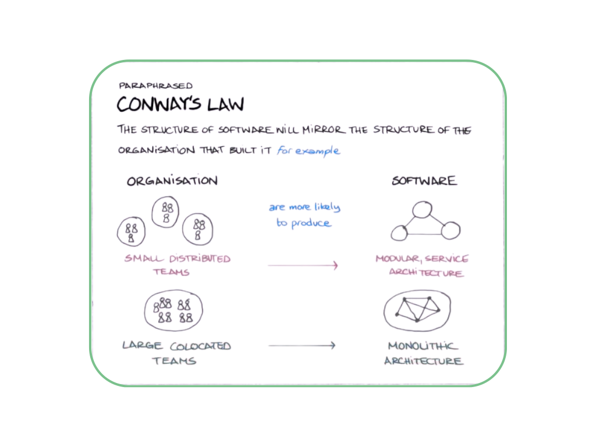
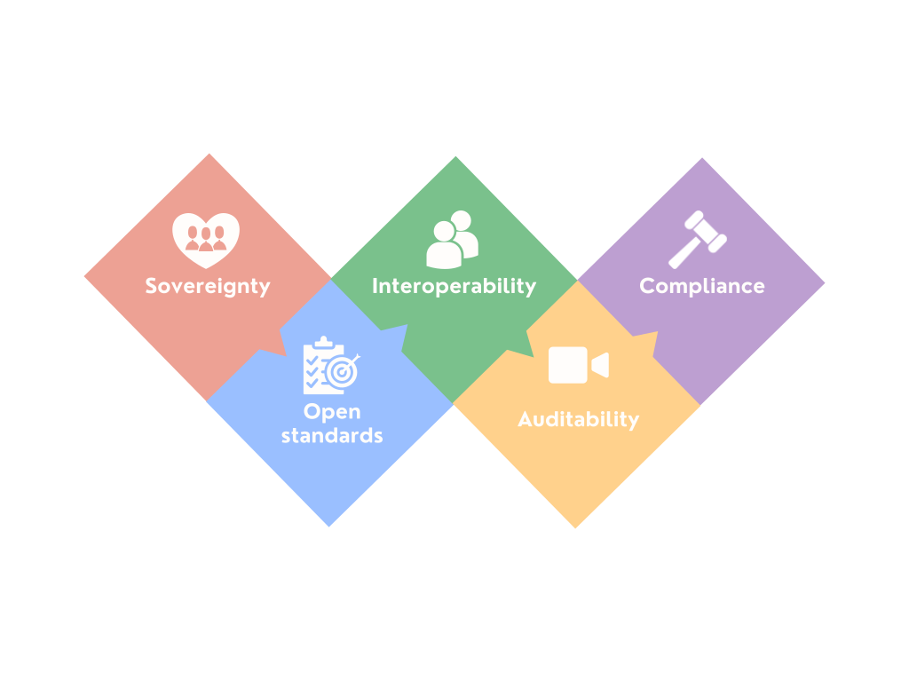
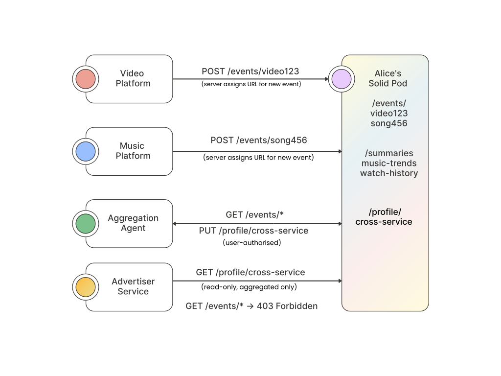
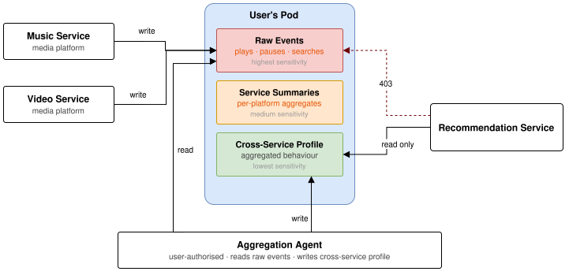
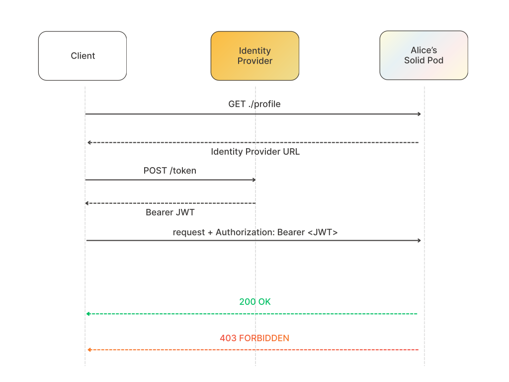
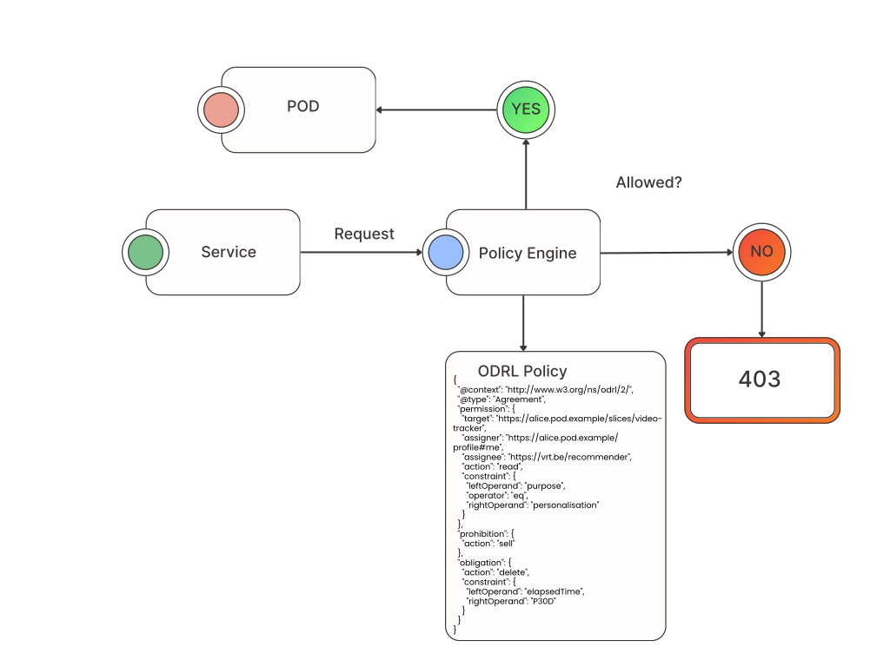
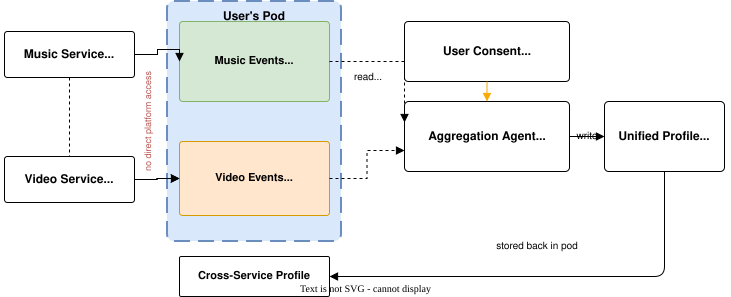
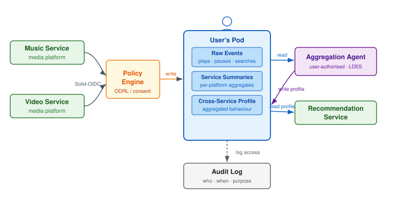
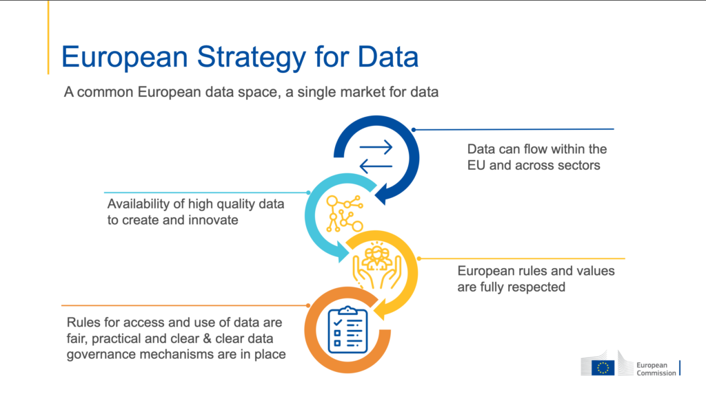

## Literature Study
{:#literature}

The central research question of this thesis asks which design decisions are required when building media behaviour profiles across multiple services in a user-centric way. Answering this question requires a clear understanding of what such profiles are, why current approaches fall short, and which technologies and architectural principles can support a more user-centric solution. The sections that follow first define media behaviour data and examine its privacy implications, then establish the core principles of a user-centric architecture, introduce the Solid ecosystem as a technical foundation, describe the individual architectural building blocks in detail, and finally situate the proposed approach within the broader European data space landscape while reflecting on the stakeholders it affects and the limitations it inherits.


### Media Behaviour Profiles: Definition and Privacy Implications
In this thesis, media behaviour profiles refers to profiles created when a user interacts with a media platform. This includes direct actions, such as playing a video, pausing content, skipping a song, or entering a search query. It also includes patterns derived from these actions over time, such as favourite genres, typical moments of use, or preferences across different platforms.

This distinction is important because raw events and derived profiles are not the same. A single play, pause, or search action may seem harmless, but when many of these events are combined, they can reveal detailed information about a person. For example, long-term media behaviour may expose routines, interests, political views, emotional states, health-related concerns, or cultural identity. This is often referred to as the mosaic effect: separate pieces of data may appear insignificant, but together they can form a sensitive and revealing profile.

<figure id="fig-mosaic">

<figcaption markdown="block">
Individual data fragments, each seemingly harmless in isolation, combine to form a detailed and revealing profile of a person.
</figcaption>
</figure>

A well-known example outside the media domain is Target’s reported use of shopping data to predict whether customers were pregnant and to target them with related advertisements [6]. Similar risks exist in media environments. Viewing history, listening behaviour, and search activity can reveal sensitive personal information, even when the original data appears ordinary. Media behaviour data should not be treated as low-risk simply because individual events seem harmless.
The privacy risk is increased by the fact that most media platforms store this data centrally. Platforms often collect, analyse, and retain behavioural data within their own infrastructure, while users have limited insight into what is stored, how long it is kept, how it is used, or with whom it is shared. This creates an imbalance: platforms can build detailed profiles of users, while users have little control over those profiles. In this context, user control means more than the ability to access or delete data. It includes the ability to determine where data is stored, which actors may access it, for which purposes it may be used, how long it may be retained, and whether derived profiles may be shared with others. 

Centralised storage can also create security and governance risks. Large behavioural datasets may become attractive targets for breaches, legal requests, and secondary uses beyond the user’s original expectations. Once behavioural data has been used to train models or create derived profiles, it may also be difficult to fully remove its influence, even if the original data is deleted. This creates tension with rights such as data erasure under the GDPR [8].

However, decentralised storage does not automatically remove these risks. The MyData initiative helps explain why. MyData is a human-centric data movement that argues that individuals should not only have formal legal rights over personal data, but also practical tools to access, control, reuse, and benefit from data about themselves. It promotes a shift away from platform-controlled data silos toward models in which the individual becomes a meaningful point of integration across services [23]. In this view, decentralisation is valuable only if it strengthens practical agency, transparency, interoperability, and accountability.

Applied to media behaviour profiles, this means that moving data from central platform databases into pods does not by itself make the architecture safer. When data is distributed across multiple pods, services, or intermediaries, security responsibility also becomes more distributed. Each pod provider, client application, aggregation component, and data-using service becomes part of the trust chain. This may make it harder to secure every storage location, application, and access path consistently. The relevant design question is therefore not whether centralised or decentralised storage is inherently safer, but whether the architecture gives users meaningful control over storage, access, reuse, usage conditions, and accountability while making security responsibilities clear and governable [23].

### Towards a User-Centric Architecture: Core Principles

A user-centric media profile architecture inverts the traditional platform-controlled model. Instead of each platform storing and governing user data independently, the user maintains their data in a personal data store. Platforms may only access or contribute to this data with explicit user consent, for a clearly defined purpose, and within a specified time frame. This introduces several requirements that guide the design choices discussed in this thesis.

**Sovereignty** is a foundational principle in the European data landscape, ensuring that individuals or organisations retain full control over the data they generate. Without sovereignty as an explicit design constraint, any user-centric system risks becoming another form of delegated control, where users technically have access to their data but lack the practical means to govern it.

**Interoperability and Open Standards** are equally important. Just as the internet depends on shared protocols such as HTTP, HTML, and URLs, user-centric systems need common standards so that independent services can exchange and interpret data. This idea is closely related to the principles discussed in the UGent micro-credential on Knowledge Graphs, where interoperability is treated as a central principle for connecting distributed data sources. Conway’s Law illustrates why this matters: system design often mirrors the communication structures of the organisations that create it [7].Without deliberate effort toward interoperability, data silos are likely to remain as a natural consequence of organisational boundaries, directly limiting the possibility of cross-service integration.

<figure id="fig-conways-law">

<figcaption markdown="block">
Organisational structure tends to mirror system design.
</figcaption>
</figure>


**Compliance** in a decentralised ecosystem cannot be implemented solely through the internal governance of one platform, because media behaviour data may involve several independent actors, including media services, pod providers, aggregation agents, application developers, and data consumers. Each actor may control only part of the data flow. As a result, compliance requires more than one organisation enforcing its own rules. It depends on shared policies, interoperable technical standards, verification mechanisms, contractual agreements, and alignment with regulatory requirements such as the GDPR [8].

Gaia-X is relevant in this context because it approaches trusted data sharing as a federated governance problem. Its Digital Clearing House concept provides verification mechanisms that can check whether participants and services comply with Gaia-X rules before they take part in data exchange [5]. This illustrates how decentralised or federated data ecosystems may require trusted verification services to support accountability across organisational boundaries. For this thesis, Gaia-X is therefore useful not as a direct replacement for Solid, but as an example of how broader data-space initiatives address trust, compliance, and interoperability at an ecosystem level.

**Auditability** follows directly from the compliance requirement: relevant data access and usage events should be traceable and verifiable when accountability, compliance, or dispute resolution requires it. Without transparent records of who accessed sensitive behavioural data, when access occurred, and for which stated purpose, it becomes difficult to detect misuse or demonstrate that data was handled according to agreed policies.

<figure id="fig-key-principles">

<figcaption markdown="block">
Key principles of a user-centric media profile architecture.
</figcaption>
</figure>


### The Solid Ecosystem as a Technical Foundation

> "When I invented the World Wide Web, I envisioned technology that would empower people and enable collaboration… Solid returns the web to its roots by giving everyone direct control over their own data."
> - Sir Tim Berners-Lee, creator of the World Wide Web [9]

The Solid initiative provides a concrete technological foundation for user-centric data management [10]. Its central concept is the **data pod** (or data vault), a decentralised storage space where individuals manage their own information independently of any platform. Users determine who can access their data, for what purpose, and for how long, directly supporting the principle of data **sovereignty** by shifting control away from what we call centralised intermediaries.

Technically, a Solid pod is an HTTP-accessible storage container that exposes its contents as Linked Data resources. Each resource is addressable by a URI and can be retrieved, created, updated, or deleted through standard HTTP verbs, which means that a pod is, in essence, a personal **slice** of the web that the user controls.

<figure id="fig-solid-pod-http">

<figcaption markdown="block">
Solid pod resources accessed via HTTP verbs.
</figcaption>
</figure>

As illustrated in figure 4, different actors interact with different parts of the pod using different verbs. A media service may POST a new interaction event or DELETE a retracted one, while an aggregation agent uses GET to read events and PUT to write back an updated profile. A recommendation service is restricted to GET on the aggregated profile container. Requests to raw event containers return 403 Forbidden. This per-resource access control is enforced by WAC or ACP policies attached directly to the pod, not by the applications themselves.

Data inside a pod is typically represented in RDF (Resource Description Framework). RDF is a standard model for describing data as relationships between things. Instead of storing information in isolated tables or application-specific formats, RDF represents data in simple statements, called triples: a subject, a predicate, and an object. For example, a media event could state that a user played a specific song at a specific time. Because each part of the statement can be identified using a URI, different applications can refer to the same concepts in a consistent way.

<figure id="lst-turtle-event" class="listing">
<figcaption markdown="block">
A media listen event represented as an RDF triple in Turtle syntax, using schema.org vocabulary.
</figcaption>

````/code/listen-event.ttl````
</figure>

RDF data can be serialised in formats such as Turtle or JSON-LD. Turtle is compact and commonly used in Linked Data environments, while JSON-LD is easier to integrate with web applications that already use JSON, since it is valid JSON that any standard JSON parser can process and allows a `@context` field to be added to existing data structures without requiring dedicated RDF tooling. Other types of resources, such as images or audio files, can also be stored in a pod.

RDF is useful because it supports semantic interoperability. This means that data written by one application can be understood by another, as long as both applications use the same vocabulary or can map between different vocabularies. For media behaviour data, this is especially relevant. A video platform and a music platform may generate different kinds of interaction events, but RDF makes it possible to describe those events in a shared structure. For example, both a watched video and a played song can be represented as media interactions with a timestamp, a content item, and a user action, using vocabularies such as schema.org or domain-specific ontologies.

<figure id="lst-both-events" class="listing">
<figcaption markdown="block">
A listen event and a watch event from two different platforms, represented in the same RDF structure using schema.org vocabulary. Both use the same predicate set, making them directly comparable by any consuming application.
</figcaption>

````/code/both-event.ttl````
</figure>

Solid defines two main access control mechanisms. **Web Access Control (WAC)** is the older and more widely implemented model. It works in a way that is similar to file permissions: users, groups, applications, and resources are identified by URIs, and permissions are attached to specific resources or containers [11]. These permissions usually define whether an actor can read, write, append to, or control a resource.

WAC is relatively simple, which makes it easy to understand and implement. The following example shows a WAC policy granting Alice read access and Bob full control over a resource in his pod:

<figure id="lst-wac-example" class="listing">
<figcaption markdown="block">
A WAC policy granting Alice read access and Bob full control over a resource in Bob's pod, using URI-identified agents and explicit permission modes.
</figcaption>

````/code/wac-example.ttl````
</figure>

However, this simplicity also limits what it can express. For example, WAC is not well suited for more specific conditions such as “only allow access when the request comes from a specific application” or “only allow access when the user is authenticated through a trusted identity provider.”

Access Control Policies (ACP) provide a more flexible alternative [12]. ACP allows access rules to be expressed in a more detailed way, including conditions about which user, application, or context is involved. This makes ACP more suitable for systems where access should depend not only on who is requesting the data, but also on why and under which conditions the data is being accessed. The following example shows an ACP policy that grants read access only when Alice is using a specific trusted application:

<figure id="lst-acp-example" class="listing">
<figcaption markdown="block">
An ACP policy granting read access to a resource only when the request comes from a specific agent using a specific client application, combining both conditions through a matcher.
</figcaption>

````/code/acp-example.ttl````
</figure>

Both WAC and ACP support an important Solid principle: access control should not be hidden inside each individual application. Instead of allowing every media platform to decide for itself what it can do with user data, access rules are linked directly to the user’s resources in the pod. For example, a user can decide that a music service may read their listening history, while another service may only access an aggregated profile. This makes the data less dependent on the internal policies of one platform and supports a more user-centric form of data governance.

However, this does not mean that the pod host is completely irrelevant. The server still enforces the access rules, which means that the hosting provider remains part of the trusted infrastructure. Nevertheless, Solid improves on traditional platform-controlled models because access policies are defined around the user’s data and can, in principle, move with the pod if the user changes provider.

Authentication is handled through **Solid-OIDC** [13], which builds on the widely adopted OAuth 2.0 and OpenID Connect standards. Users are identified through a **WebID** [14], a globally unique, user-controlled URI, enabling identity verification across services. The WebID is typically hosted within the user's own pod, which means that the user's identity document is itself a piece of data they control, and can be updated, extended, or moved without requiring the cooperation of any identity provider.

For deployment within the European context, the Community Solid Server (CSS), developed by imec and Ghent University, offers a ready and open-source implementation of the Solid specifications [15]. CSS is modular by design, with configurable components for storage backends, authentication flows, and access control mechanisms. This makes it useful for research prototypes and experimental deployments where different architectural choices need to be tested. Joachim Van Herwegen and Ruben Verborgh explicitly describe CSS as an implementation of the Solid specifications tailored towards research and development, prioritising modularity and extensibility over production-scale throughput [24].

While Solid provides a useful foundation for user-controlled storage and access control, it does not solve every governance problem on its own. Access control mainly answers the question: “Is this agent allowed to access this resource?” However, it does not fully answer questions such as: “For which purpose may the data be used?”, “How long may it be retained?”, or “Can it be shared with others?” These questions are especially important for media behaviour profiles, because the sensitivity of the data depends not only on who accesses it, but also on how it is used. Therefore, additional mechanisms are needed for policy enforcement, cross-service aggregation, auditability, and legal compliance. These are discussed in the following sections.


### Requirements for a User-Centric Architecture

The previous sections have established the principles, privacy concerns, and technical standards that a user-centric media profile architecture must draw on. This section derives five concrete requirement areas from that body of literature, each specifying what a component must be capable of, independent of which technology implements it. The GDPR and the Solid ecosystem together ground the requirements for personal data storage [8, 10]. WebID and Solid-OIDC define what an identity and authentication mechanism must provide [13, 14]. ODRL and the TrustFlows framework establish what a policy layer must be able to express [17, 21]. The MyData model of user-authorised data integration informs the aggregation requirements [23]. Finally, GDPR accountability and transparency obligations set the bar for auditability [8, 26].

#### Personal Data Store

A user-centric architecture requires a personal data store that enforces access policies per resource, exposes its contents in a machine-readable and interoperable format, and supports data portability so that the user is not locked into a single provider [8]. Without per-resource access control, data minimisation cannot be achieved: services would need to be trusted to self-limit their access rather than being technically constrained. Without interoperability, data contributed by one service cannot be consumed by another.

For media behaviour data, the store must also support partitioned storage. Raw interaction events, per-service summaries, and an aggregated cross-service profile have different sensitivity levels and should be governed by different access rules. A music service must be able to append new listening events without gaining read access to video behaviour. A recommendation service must be able to read an aggregated profile without gaining access to raw events. The store must therefore allow different access rules to be attached to different parts of the data.

<figure id="fig-pod-partitioning">

<figcaption markdown="block">
The user's pod partitioned into three containers at different sensitivity levels. Media services may only write to raw event containers. The aggregation agent reads raw events and writes back a cross-service profile. The recommendation service may only read the aggregated profile, and is denied access to raw events.
</figcaption>
</figure>

For continuously generated media behaviour data, the store must additionally handle high-volume ingestion and support change notifications so that downstream processors can react to new events incrementally rather than polling the full dataset.

For high-volume media behaviour data, the choice of Solid server implementation matters significantly. Kvasir is a cloud-native, microservice-based platform developed at imec-IDLab that functions as a scalable data broker within the Solid and Linked Data ecosystem [16]. Unlike CSS, which prioritises modularity and research flexibility, Kvasir is built around industry-standard infrastructure including Apache Kafka for event streaming and ClickHouse for analytical storage. It exposes data through multiple APIs including native RDF formats such as JSON-LD and Turtle, GraphQL, and S3-compatible interfaces, and provides built-in multi-tenancy, fine-grained access control, and real-time push notifications. This makes Kvasir well-suited for applications that generate continuous streams of behavioural data, where a file-based reference implementation would not meet the performance requirements.

#### Identity and Authentication

The architecture requires a shared, user-controlled identity mechanism that allows data from different services to be attributed to the same user without depending on any single platform’s identity system. Without such a mechanism, a cross-service profile cannot be built: each platform would identify the user differently, and there would be no stable point of integration. In Solid, this role is fulfilled by the WebID [14], a globally unique URI the user controls.

Authentication is handled through Solid-OIDC [13], which builds on OpenID Connect. It allows applications to verify a user’s identity and request access to resources in the user’s pod.

However, identity also creates privacy challenges. If the same WebID is used across many services, it may become a point of correlation. Several services could recognise that they are interacting with the same user. For this reason, privacy-preserving deployments may require different WebIDs for different contexts, such as personal media use, professional activity, or research participation.

Together with WAC or ACP, WebID and Solid-OIDC support a user-centric access model. Users can identify themselves across services, while access to their data remains governed by policies attached to resources in their own pod. This supports portability, but it also shows that identity design must carefully balance convenience and privacy.

For media behaviour profiles, this means that identity design must allow users to separate different services and access decisions. What a music platform knows about a user should not automatically become available to a video platform simply because both use the same identity mechanism.

<figure id="fig-identity-provider">

<figcaption markdown="block">
WebID and Solid-OIDC enable a user to authenticate across independent services using a single user-controlled identity document hosted in their pod.
</figcaption>
</figure>

#### Policy Enforcement

Access control alone is insufficient. The architecture requires a policy layer capable of expressing and enforcing conditions on data use that go beyond simple read and write permissions. A service may be technically permitted to read listening-history data without that permission saying anything about how long the data may be retained, whether it may be shared, or whether it may be used for advertising. These usage constraints cannot be expressed in WAC or ACP.

This is where the concept of TrustFlows becomes relevant. TrustFlows.eu [21] describes TrustFlows as an approach for building trustworthy data flows that are interoperable, legally compliant, and user-centric. In this thesis, the term is used to refer to governed data flows in which data does not simply move between actors, but moves together with explicit conditions, responsibilities, and evidence for accountability.

For this reason, the architecture requires a policy layer. Data exchanges can be governed through policies expressed in ODRL: the Open Digital Rights Language [17]. ODRL can describe permissions, prohibitions, and duties related to data use. For example, a policy could allow a recommendation service to use viewing-history data for personalisation, prohibit sharing it with advertising networks, and require deletion after a defined period.

A policy engine can evaluate these rules before access is granted. In this architecture, the policy layer sits between the requesting service and the data stored in the pod. When a service requests access, the policy engine evaluates the request against the applicable ODRL policy by checking four elements: the requesting party, the requested action (such as read or write), the target resource, and any constraints attached to the policy, such as a stated purpose, a retention limit, or a prohibition on secondary use. If the request satisfies all conditions, access is granted. If any element does not match, access is denied.

<figure id="fig-odrl">

<figcaption markdown="block">
The ODRL policy layer intercepts access requests and evaluates them against user-defined permissions, prohibitions, and duties before granting or denying access to pod resources.
</figcaption>
</figure>

This makes governance more proactive. Instead of only detecting misuse afterwards, some restrictions can be enforced before data is accessed. However, technical enforcement has limits. Once a service has legitimately received data, a policy engine cannot fully prevent later misuse outside the pod environment. This is why policy enforcement must be combined with audit logs, accountability mechanisms, and legal safeguards.

In this architecture, TrustFlows therefore connects policy enforcement with accountability. The policy layer helps determine whether a data exchange is allowed, while audit mechanisms provide evidence of which exchanges occurred and under which stated conditions. Together, these mechanisms support data flows that are not only technically possible, but also governed, explainable, and verifiable.

#### Aggregation

The architecture requires a user-authorised aggregation component that can read permitted data from multiple service partitions, derive a unified cross-service profile, and write that profile back to the store under separate access rules [23]. This component must not require platforms to share data directly with each other: instead, each service contributes to the user’s store, and the aggregation component operates on that store on the user’s behalf.

The purpose of this separation is to avoid giving every platform direct access to all raw behavioural data. Instead, services can contribute events or summaries, while the aggregation agent produces a profile that can later be shared under separate access rules. For example, a video platform and a music platform may both contribute interaction data, but a recommendation service may only receive access to the aggregated profile.

The aggregation component must therefore be configurable at the level of the user’s consent: which services are included, which data types are considered, and how long intermediate data is retained must all be governed by the user’s stated preferences rather than by the component’s internal logic [23].

For continuously generated media behaviour data, efficiency is important. Reprocessing the full dataset every time the profile is updated would become inefficient as the amount of data grows. Event streaming techniques such as Linked Data Event Streams (LDES) can help address this [18]. An LDES represents data as a stream of timestamped events that can be processed incrementally. This allows the aggregation agent to consume only new or changed events instead of recalculating the entire profile each time.

This is especially relevant for media behaviour data, where new events may be generated frequently. Incremental aggregation can reduce processing overhead and make the profile easier to keep up to date.

<figure id="fig-aggregation-flow">

<figcaption markdown="block">
The aggregation agent reads only new events from each service partition using LDES, governed by user consent settings. It derives a unified cross-service profile and writes it back to the pod, without any platform having direct access to another platform's data.
</figcaption>
</figure>

#### Auditability

Because data is no longer governed by one central platform, the architecture requires mechanisms that make access and usage transparent and verifiable after the fact [26]. In a centralised system, a single party holds all access logs internally. In a decentralised architecture, no such party exists, which means auditability must be designed in explicitly rather than assumed. The architecture therefore requires that every access by a service, a policy engine, or an aggregation component produces a traceable record of who accessed what, when, and for which stated purpose. These records must be available to the user directly, not just to the hosting provider, so that users and regulators can verify that data was handled according to agreed conditions. This supports compliance with GDPR principles of transparency, accountability, and data protection by design [8], but it also goes beyond compliance: auditability is what makes the architecture’s claims about user control credible in practice.

These five building blocks are not independent. They form a chain: when a media service records a user interaction, it authenticates with its own service credentials and writes the event to the container in the user's pod to which the user has previously granted it write access. The policy engine checks whether this write matches the user's stated consent before it is permitted. Periodically, the aggregation agent reads permitted data from multiple service containers, computes a cross-service profile, and stores it back in the pod. Every access by the service, the policy engine, and the aggregation agent is recorded in an audit log the user can inspect. This chain connects identity, storage, policy, aggregation, and auditability into a single governed data flow that is transparent at every step.

<figure id="fig-architecture-overview">

<figcaption markdown="block">
The five architectural building blocks and their interactions. Media services authenticate via Solid-OIDC and write events through the policy engine to the user's pod. The aggregation agent reads events and writes back a cross-service profile. Every access is recorded in the audit log.
</figcaption>
</figure>

### Dataspace Integration and Eventual Interoperability

The proposed architecture also fits within the broader European data space vision. The European Strategy for Data promotes trusted and interoperable data sharing across sectors [19], while initiatives such as Gaia-X show that decentralised ecosystems still require shared governance, verification mechanisms, and trust frameworks [5]. In this thesis, Solid addresses the user-controlled personal data layer, while data space initiatives provide useful context for future organisational interoperability.

<figure id="fig-eu-data-space">
  
  <figcaption>
    European Strategy for Data: a common European data space enabling trusted and interoperable data sharing across sectors (European Commission).
  </figcaption>
</figure>

This connection is expressed through eventual interoperability: the system does not need to align with every future data space standard from the start, but it should use explicit semantics, stable identifiers, and open standards so that later integration remains possible [22].

### Stakeholder Considerations

To situate the proposed architecture within the Flemish media landscape, a structured written questionnaire was conducted with a practitioner from the Flemish media sector. MediaNet Vlaanderen is a cross-media consultation platform that brings together more than 80 organisations active in content creation and distribution within the Flemish media sector. The respondent is a Programme and Communications Director there, with direct operational experience in media data governance and involvement in the Solid4media initiative, an ongoing industry project that explores the application of Solid technology to media data management and closely aligns with the scope of this thesis.

The consultations suggest that media behaviour profiles may be valuable not only for personalisation, but also for organisations that analyse media trends and innovation, with analyses of media professionals’ evaluations of technological innovation described as “very valuable.” At the same time, a concern was raised about transparency: user-facing insights should remain simple and understandable, so that transparency does not become too complex to interpret in practice. This supports the need for usable consent flows, clear access explanations, and manageable policy interfaces as part of the proposed architecture.

A personal data vault architecture is considered feasible only in the medium term. The main barrier is ecosystem adoption: such a system becomes valuable only when a sufficiently large pool of participating services and users exists. This reinforces the idea that the proposed architecture is not only a technical system, but also a sociotechnical one that depends on scale, trust, governance, and stakeholder incentives to deliver its intended value.


### Limitations and Challenges of User-Centric Media Profile Architectures

Several challenges remain. The first is adoption. A user-centric architecture only becomes useful when multiple services support it. If only one or two platforms participate, the value of a cross-service media profile remains very limited. This creates a chicken-and-egg problem: platforms may hesitate to adopt the system until users demand it, while users may not see its value until enough platforms support it. Technical design alone cannot solve this. Adoption would also require incentives, regulation, partnerships, and use cases that clearly show the benefits of the approach. This barrier was also identified in the expert questionnaire conducted for this thesis, where a personal data vault architecture was described as feasible only in the medium term precisely because ecosystem adoption is a precondition for its value [23].

Performance is another important design constraint. A decentralised architecture may introduce more latency than a centralised platform model. Data may need to move between services, pods, policy engines, and aggregation agents before a result can be produced. Research into decentralised search and querying over Solid pods has shown that distributing data across many independent storage locations introduces significant overhead compared to centralised indexing, particularly for operations that span multiple pods [25]. Some of this overhead can be reduced through caching, pre-computed profiles, or incremental updates, but performance remains a relevant constraint especially for features that require fast responses.

A third challenge is usability. Giving users more control over their data is valuable, but it can also make the system harder to use. If users are asked to approve too many permissions or understand complex policies, they may become overwhelmed or simply accept requests without reading them. This would weaken the goal of meaningful user control. The MyData initiative explicitly identifies practical usability as a key requirement for user-centric data systems, noting that formal legal rights over data are insufficient without tools that are understandable and manageable in practice [23].

Standardisation is also necessary. Technologies such as Solid, ODRL, and LDES provide important building blocks, but they do not automatically guarantee interoperability. Services still need to agree on shared vocabularies, data models, profile structures, and conformance rules. Without this coordination, different implementations may technically follow the same standards but still fail to work together in practice. As Colpaert argues, governance and shared semantics are just as important as the technical standards themselves [22].

Finally, security and threat modelling remain major concerns. Moving data away from centralised platforms does not remove security risks, it changes where those risks appear. A systematic assessment of the Solid protocol against security and privacy obligations has shown that most known threat categories apply to Solid environments, including risks such as token theft through malicious pods and identity injection via WebID documents [26]. Because responsibility for security is distributed across pod providers, client applications, and identity providers, consistent enforcement becomes harder to guarantee than in a centralised system.

These limitations do not make the proposed architecture unsuitable, but they show that its success depends on more than the technical design. Adoption, performance, usability, standardisation, and security all influence whether a user-centric media profile architecture can work in practice. The approach should therefore be understood as a sociotechnical system: it requires not only protocols and software, but also governance, incentives, and trust.
