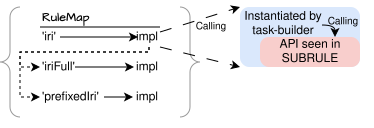

## Architecture
{:#architecture}

<!--
The architecture is a direct consequence of the requirements:
1. Flexibility -> chevrotain + builder based inversion of control,
2. round-tripping -> AST can track source location + generator builder has helpers
3. web-based -> typescript,
4. language agnostic -> The core lib is generic, meaning generic builders and transformers.
-->

In this section, we go into more detail on the architecture implemented in Traqula, and how we extended the
architectural vision towards query generation and transformation.
We explain how Traqula exists of many small, interlinkable packages,
and provide more detail on the core package which contains the language agnostic builders and transformers.

### Builder-based Dependency Injection

At the core of Traqula's flexibility is its builder-based dependency injection architecture.
[Dependency injection](cite:cites fowler-dep-inj) is a software design that promotes flexible software by
creating objects or functions that receive the components they rely on, rather them instantiating them directly,
allowing them to treat their dependencies more conceptually.
In Traqula each functional element, such as a parser rule, generator rule, or transformation step,
is declared under a symbolic name, and refers to other rules by name rather than by concrete implementation.
This indirection enables users to replace or patch functionality simply by adjusting the mapping from names to functions.
 (left) illustrates this idea,
while  (right) shows Traqula's TypeScript definition of the `iri` parser and generator rules, each depending on named subrules.

<figure id="rulemap">

<!-- <object type="image/svg+xml" data="img/traqula-rulemap-single.svg" style="width: 80%"></object> -->

<pre style="overflow: auto; margin: 0"><code class="language-typescript" style="background: unset; font-size: 0.8em">export const iri: SparqlRule&lt;'iri', TermIri&gt; = {
  name: 'iri',
  impl: ({ SUBRULE, OR }) => () => OR&lt;TermIri&gt;([
    { ALT: () => SUBRULE(iriFull) },
    { ALT: () => SUBRULE(prefixedName) },
  ]),
  gImpl: ({ SUBRULE }) =>
    (ast, { astFactory: F }) =>
      F.isTermNamedPrefixed(ast) ?
        SUBRULE(prefixedName, ast) :
        SUBRULE(iriFull, ast),
};</code></pre>

<figcaption markdown="block">
**Left:** A mapping from rule names to their implementations, as registered by the user.
In this example, the `iri` rule depends on the named rules _`iriFull`_ and _`prefixedIri`_.
At execution time, the implementation of `iri` consults the user-provided map to resolve these names to their concrete implementations.

**Right:** [Traqula's TypeScript declaration](https://github.com/comunica/traqula/blob/2f0e975d4abf458ced15b93d56af737bfe336ad2/packages/rules-sparql-1-1/lib/grammar/literals.ts#L233-L245) of the same `iri` rule.
The rule is defined under the name _iri_, and provides both a parser implementation (`impl`) and a generator implementation (`gImpl`).
The use of _'SUBRULE'_ reflects the same _name-based lookup_ shown in the left figure,
delegating execution to the implementations registered under the names `iriFull` and `prefixedIri`.
</figcaption>
</figure>

To manage and share these rule dictionaries, Traqula adopts the
[builder design pattern](https://refactoring.guru/design-patterns/builder){:.mandatory}.
Builders construct complex, modular objects step by step, and expose a uniform API for composing, extending, and patching rules.
By implementing the builder pattern directly in the host language,
Traqula avoids the need for additional compilation stages and allows builders to be referenced, extended, and combined programmatically.
This choice also makes it possible to integrate language-specific features,
most notably static type checking, into the dependency-injection mechanism itself.
Traqula provides three task-specific builders: a parser builder, a generator builder, and a general indirection builder.
All share the same underlying rule dictionary,
differing only in the `build` artifact they produce, and the supplementary dependencies they inject.

Each builder exposes the same operations to manage the rule dictionary.
 illustrates the core management functions,
creating a builder, adding a rule, patching a rules, and building the final artifact .

<figure id="builder">
<pre style="overflow: auto"><code class="language-typescript" style="background: unset; font-size: 0.8em">const iriGeneratorBuilder = GeneratorBuilder
  .create([iriFull, prefixedIri])
  .addRule(iri);
const specialIriGenerator = GeneratorBuilder
  .create(iriGeneratorBuilder)
  .patchRule(alternativePrefixedRule)
  .build();</code></pre>
<figcaption markdown="block">
Construction of a 'special IRI generator' based on an existing builder for building a IRI generator,
patching it with an alternative rule implementation for the _'prefixedIri'_ rule.
</figcaption>
</figure>

### Modular Packages

To maximize independent evolution and minimise unnecessary dependencies,
Traqula is composed of many small, interlinked packages rather than a single big monolithic package.
As a user, you only need to depend on what you actually use.
For example, if you only require SPARQL 1.1 parsing, you can depend solely on _'@traqula/parser-sparql-1-1'_,
without needing to pull in, and consider the SPARQL 1.2 parser, the generators, or transformers Traqula maintains.
Beyond flexibility and extensibility, this modular architecture is crucial for controlling bundle size, a key requirement for modern Web applications.
By allowing developers to import only the necessary components, Traqula avoids the overhead of shipping unused functionality to the browser,
improving load times and performance.

Modularity also reinforces well-defined and stable package interfaces: because Traqula itself is built from these packages,
its APIs must remain open for extension.
For maintainability and version control, all packages are managed as a [monorepo](https://monorepo.tools/){:.mandatory} in a single GitHub repository under the Comunica organisation:
[https://github.com/comunica/traqula](https://github.com/comunica/traqula).

### Language-Agnostic Core Package

Following the modular package design, Traqula provides a central language-agnostic core package containing the generic builders and transformers.
These components are designed to be reusable across different query languages,
whether for dialects of SPARQL or entirely different languages such as SHACL-compact or GQL.
The core package underpins Traqula's flexibility, enabling parsers, generators, and transformations to be composed in a language-independent manner.

A key feature of the core package is the generic transformers and visitors,
which facilitates AST- and algebra-level transformations/ visiting.
This transformer is type-safe, ensuring correctness, leveraging TypeScript's generics to adapt dynamically to the AST or algebra representation being manipulated.
Beyond enabling rewrites and translations between query languages,
the transformers also support AST-level reformatting, since reformatting can be expressed as a transformation on the AST level in the case of Traqula.

To use the transformer, one instantiates a new transformer object, specifying the types of AST nodes, and optionally providing a default transformation context.
Transformations can be guided through preVisitors, allowing you to 
<!-- -->
1. stop traversal completely;
2. continue traversal into descendents;
3. skip specified properties of the current node;
4. copy certain keys without traversal; and
5. shallowly copy the current node.
<!-- -->
The transformer maintains a stack of nodes to be transformed, ensuring that descendant nodes are processed before their parents.
 illustrates a simple algebraic transformation that wraps a _'distinct'_ operation around the first _'project'_ node it encounters.

<figure id="transformer">
<pre style="overflow: auto"><code class="language-typescript" style="background: unset; font-size: 0.8em">const transformed = new TransformerTyped&lt;Sparql11Nodes&gt;()
  .transformNode({ // A query as AST
    type: Algebra.Types.SLICE,
    input: {
      type: Algebra.Types.PROJECT,
      input: {
        type: Algebra.Types.JOIN,
        input: [{ type: Algebra.Types.PROJECT }, { type: Algebra.Types.BGP }],
      },
    },
  }, {
    [Algebra.Types.PROJECT]: { // Transformation of projections
      preVisitor: () => ({ continue: false }),
      transform: projection => algebraFactory.createDistinct(projection),
    },
  });</code></pre>
<figcaption markdown="block">
Example usage of the transformer to wrap a _'distinct'_ node around the first _'project'_ node in an algebraic expression.
</figcaption>
</figure>

