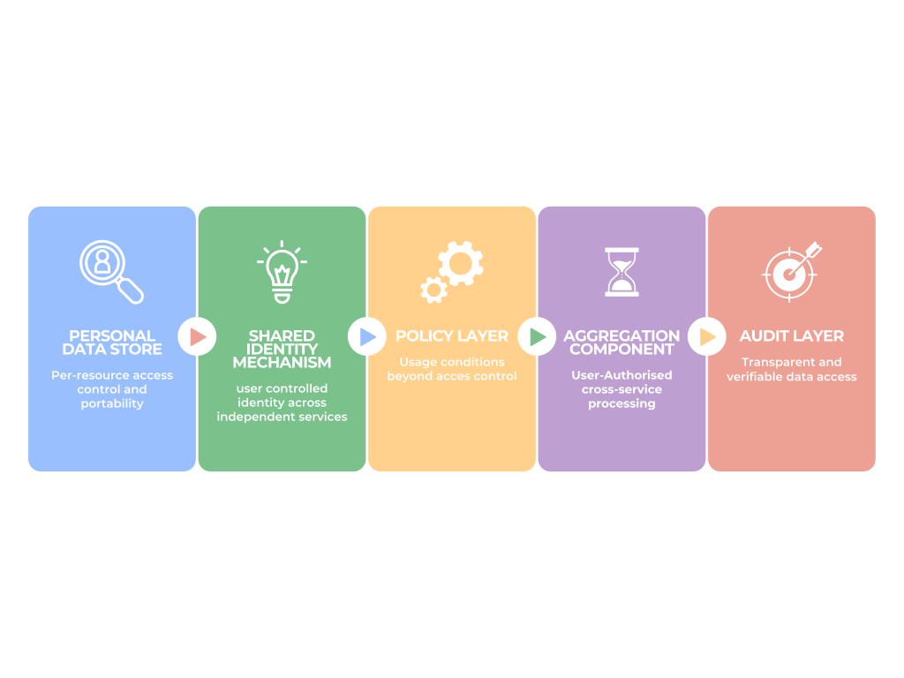
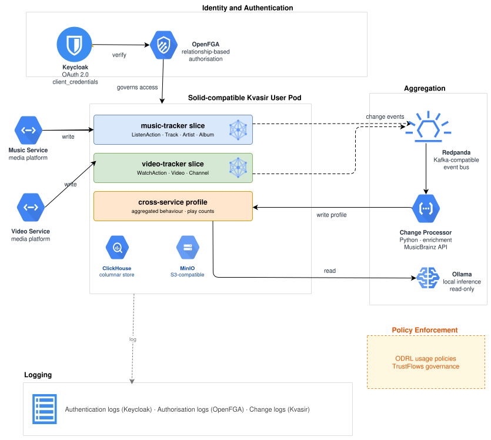

## Architecture and Design Decisions
{:#architecture}

The previous chapter established the theoretical foundations and requirements for a user-centric media behaviour profile architecture. It identified five requirement areas that any valid architecture must address: a personal data store with per-resource access control and portability, a shared identity mechanism, a policy layer for usage conditions beyond access control, a user-authorised aggregation component, and auditability mechanisms that make data access transparent and verifiable. These are summarised in .

<figure id="fig-requirements">

<figcaption markdown="block">
The five requirement areas that any valid user-centric media behaviour profile architecture must address, as established in the literature study.
</figcaption>
</figure>

This chapter translates those requirements into concrete architectural design decisions. It answers the central research question of this thesis: **which key design decisions need to be made when building media behaviour profiles across multiple media services?**

The chapter distinguishes between two levels of design. At the abstract level, each section defines a component role and the responsibility that role must fulfil. At the prototype level, each section describes one concrete implementation choice used in the proof of concept. This distinction is important because the architectural contribution of this thesis is **not tied to one specific technology stack**. A deployment using the Community Solid Server instead of Kvasir, WAC or ACP instead of OpenFGA, or LDES instead of Redpanda would still implement the same architecture if the same responsibilities are fulfilled.

The design decisions are guided by five principles established earlier in this thesis. European data sovereignty requires that personal media data remains under user control and is governed in line with European values and regulation. W3C open standards ensure that data and identity are not locked into proprietary formats. Open-source implementation supports transparency, reproducibility, and adaptability. Interoperability across autonomous stakeholders allows independent media services, storage providers, and processing components to participate without sharing one internal infrastructure. Finally, competency questions provide the functional test: the architecture is valid only if it can answer the questions it was designed to support.

### Competency Questions

Before defining the architectural components, it is necessary to define what the system must be able to answer. Competency questions translate the research question into concrete functional requirements. Three questions were formulated and assessed through a structured written questionnaire completed by a practitioner from the Flemish media sector. The respondent holds a senior position at MediaNet Vlaanderen, has operational experience with media behaviour data, and is involved in the Solid4media initiative. The questionnaire therefore provided practical input on which capabilities are most relevant from a media-sector perspective.

**CQ1: Which content has a given user consumed within a specified time period?**
This is the foundational retrieval question. The system must be able to retrieve a user’s listening and viewing history, filtered by time, through an authorised access point. Answering this question requires a queryable data store, stable user identifiers, and a semantic data model that represents media events consistently across services. The expert rated this as the most relevant competency question.

**CQ2: Which services may access which parts of a user’s consumption history, and under what conditions?**
This is the governance question. The system must support selective disclosure, for example allowing one application to access watched films from the past year without exposing music listening history or raw interaction events. Answering this question requires data partitioning, per-partition access control, and a policy layer capable of expressing usage conditions. The expert rated this question highly, confirming the practical importance of user-controlled access and sharing.

**CQ3: How can consumption data from multiple platforms be integrated in a standardised way?**
This is the interoperability question. The system must allow data from independent media services to be combined without requiring those services to share internal databases or proprietary schemas. Answering this question requires shared semantics, stable external identifiers, and an aggregation component that operates on behalf of the user. The expert rated this question moderately, noting that standardised integration would be valuable for media trend analysis and innovation research, while ecosystem adoption remains the larger practical barrier.

Together, these competency questions define the minimum capability of the architecture. A system that cannot answer CQ1 cannot function as a media behaviour profile store. A system that cannot answer CQ2 cannot be considered user-centric. A system that cannot answer CQ3 does not justify the cross-service premise of this thesis.

With these requirements established,  presents the full system architecture. Reading the diagram from left to right follows the data flow. The Music Service and Video Service write media events into the Kvasir User Pod, where they are stored in typed slices. Each slice emits change events to Redpanda, which triggers the Change Processor. The Change Processor enriches raw media events with external metadata, derives aggregated insights, and writes the resulting cross-service profile back into the pod. Ollama reads this profile to generate local recommendations. The identity and authentication layer governs each interaction: Keycloak issues service tokens and OpenFGA evaluates whether the requesting service has the required relationship on the target slice. The logging layer records authentication, authorisation, and change events for retrospective accountability. The ODRL-based policy layer is included in the conceptual architecture but remains future work in the prototype. It would, for example, allow a user to permit a recommendation service to read their viewing history for personalisation while prohibiting that service from retaining a copy or sharing it with third parties.

Three implementation choices in the prototype deviate from the Solid-native mechanisms recommended in the literature. These are described in full in the section on prototype deviations at the end of this chapter.

<figure id="fig-system-architecture">

<figcaption markdown="block">
System architecture of the prototype. The identity and authentication band at the top governs access through Keycloak and OpenFGA. Media services write events into typed Kvasir slices. Change events flow through Redpanda to the Change Processor, which enriches the events and writes a cross-service profile back to the pod. Ollama reads the profile for local inference. The logging layer records authentication, authorisation, and change events. ODRL-based policy enforcement is shown as future work.
</figcaption>
</figure>

The relationship between the architectural roles, prototype choices, and competency questions is summarised in .

<figure id="tbl-architecture-traceability" class="table">
<figcaption markdown="block">
Traceability between architectural roles, prototype choices, and competency questions.
</figcaption>
<table>
<thead>
<tr>
<th>Architectural role</th>
<th>Prototype choice</th>
<th>Main responsibility</th>
<th>Competency questions</th>
</tr>
</thead>
<tbody>
<tr>
<td>Personal data store</td>
<td>Kvasir User Pod</td>
<td>Store user-controlled media behaviour data</td>
<td>CQ1, CQ2</td>
</tr>
<tr>
<td>Data partitioning</td>
<td>Kvasir slices</td>
<td>Separate raw and aggregated data under different access rules</td>
<td>CQ2, CQ3</td>
</tr>
<tr>
<td>Analytical storage</td>
<td>ClickHouse and MinIO</td>
<td>Support high-volume event queries and binary asset storage</td>
<td>CQ1, CQ3</td>
</tr>
<tr>
<td>Identity provider</td>
<td>Keycloak and Solid-OIDC endpoint</td>
<td>Identify users, services, and background components</td>
<td>CQ1, CQ2</td>
</tr>
<tr>
<td>Authorisation engine</td>
<td>OpenFGA</td>
<td>Enforce per-slice read and write permissions</td>
<td>CQ2</td>
</tr>
<tr>
<td>Semantic data model</td>
<td>JSON-LD, schema.org, Music Ontology</td>
<td>Represent media events consistently across services</td>
<td>CQ1, CQ3</td>
</tr>
<tr>
<td>Event bus</td>
<td>Redpanda</td>
<td>Notify processors when new events are written</td>
<td>CQ1, CQ3</td>
</tr>
<tr>
<td>Aggregation processor</td>
<td>Python change processors</td>
<td>Enrich events and derive cross-service profiles</td>
<td>CQ1, CQ3</td>
</tr>
<tr>
<td>Inference service</td>
<td>Ollama</td>
<td>Generate recommendations from the profile without external data transfer</td>
<td>CQ1</td>
</tr>
<tr>
<td>Policy layer</td>
<td>ODRL, future work</td>
<td>Express and enforce usage conditions after access</td>
<td>CQ2</td>
</tr>
<tr>
<td>Audit layer</td>
<td>Authentication, authorisation, and change logs</td>
<td>Record who accessed or changed which data</td>
<td>CQ2</td>
</tr>
</tbody>
</table>
</figure>

### Personal Data Store

In conventional media platforms, behavioural data is stored within the platform's own infrastructure. The platform determines what is retained, how it is analysed, and with whom it is shared. A user-centric architecture reverses this model. Media behaviour data must be stored in a personal data store controlled by the user, while services receive access only under explicitly authorised conditions.

The architectural requirement is therefore that the personal data store must support four properties. First, it must enforce access rules at the level of individual resources or partitions. Second, it must expose data in a machine-readable and interoperable format. Third, it must support portability so that the user is not locked into one provider. Fourth, it must provide a way for downstream components to detect changes, because media behaviour data is generated continuously.

The Solid ecosystem provides the natural foundation for this role. A Solid pod is a user-controlled data store that exposes resources through web standards and allows access to be governed by policies attached to the data. In principle, several implementations could fulfil this role, including the Community Solid Server, Inrupt Enterprise Solid Server, or future Solid-compatible servers. A non-Solid personal SPARQL endpoint or linked data server could also satisfy the same architectural role if it provides equivalent guarantees for user control, access control, interoperability, and portability.

The prototype uses Kvasir as the personal data store. Kvasir is a Solid-based data broker developed at imec-IDLab. It extends the standard Solid resource model with schema-governed slices, a GraphQL query interface, event notifications, and analytical storage. These additions make it suitable for high-volume structured media behaviour data. In , Kvasir is shown as the central Kvasir User Pod.

This choice should not be interpreted as making Kvasir the architecture itself. Kvasir is one implementation of the personal data store role. The architectural decision is that media behaviour data must be stored around the user rather than inside individual media platforms.

### Data Partitioning

A user-centric system must not store all media behaviour data in one undifferentiated graph. If all data is stored together, selective sharing becomes difficult. A music service that writes listening events could gain visibility into video behaviour. A recommendation service that only needs an aggregated profile could receive unnecessary access to raw events. This would violate data minimisation and weaken user control.

The architecture therefore requires data partitioning. Raw listening events, raw viewing events, enriched media metadata, and aggregated cross-service profiles should be stored in separately governable areas. Each partition must be independently authorisable, independently queryable, and independently subscribable.

In a standard Solid deployment, this role could be fulfilled through containers governed by WAC or ACP policies. In a SPARQL-based system, named graphs could serve a similar purpose. Another alternative would be to use separate pods for different media domains. The mechanism is less important than the property it provides: access must be controllable at a level more precise than the whole pod.

The prototype implements partitioning through Kvasir slices. A slice is a schema-governed partition of the user pod, with its own data model, access rules, and change stream. The prototype defines two input slices: `music-tracker` for listening events, tracks, albums, and artists, and `video-tracker` for watch events, videos, and channels. A third partition, the `cross-service profile`, stores the aggregated output produced by the Change Processor. This partition holds two kinds of data. The first is per-creator interaction counters, derived by aggregating listening and viewing events across the music and video slices. The second is confirmed identity links between music creators and video creators, expressed as `schema:sameAs` triples. When a user confirms that a SoundCloud artist and a YouTube channel belong to the same person, the system writes this assertion to the cross-service profile. The pod thereby becomes the authoritative source of identity decisions rather than relying on heuristic name matching.

This directly supports CQ2. A service may be granted write access to the `music-tracker` slice without receiving access to the `video-tracker` slice. A recommendation service may be granted read access to the aggregated profile without seeing raw event histories. The user does not need to understand the full RDF graph to benefit from selective disclosure. The partitioning structure makes access boundaries explicit.

The trade-off is that Kvasir slices do not behave exactly like standard Solid containers. They are accessed through GraphQL queries and JSON-LD delta writes rather than only through LDP HTTP operations [27]. This improves query expressiveness and analytical performance, but it means that the prototype is not a pure standard Solid resource implementation. The architecture remains Solid-based in orientation because it is centred on a user-controlled pod, linked data, and access rules attached to user data. The prototype, however, uses Kvasir-specific mechanisms to support the workload.

Replacing Kvasir with a different Solid server would therefore require significant rewriting of the implementation. The ingestion layer would need to use LDP HTTP instead of Kvasir’s GraphQL interface. The change processor would need to consume Solid notifications or LDES instead of Redpanda events. Access control would need to be reconfigured from OpenFGA to WAC or ACP. These are implementation changes, not changes to the architectural roles.

### Analytical Storage and Binary Assets

Media behaviour profiles are append-heavy and aggregation-heavy. Every play, pause, skip, search, or watch action creates a new event. Useful profile queries often aggregate over large event sets: most-played artists, most-watched channels, repeated interests, recent consumption patterns, or changes over time. The storage layer must therefore support efficient analytical queries, not merely the storage of RDF triples.

A traditional RDF triplestore offers strong semantic query capabilities through SPARQL, which is valuable for graph traversal and semantic reasoning. However, media behaviour profiling also requires fast aggregation over large volumes of timestamped events. A relational database such as PostgreSQL can support aggregation, but does not offer native semantic graph capabilities. A column-oriented analytical store is therefore a suitable trade-off for the prototype workload.

The prototype uses ClickHouse [28] as the analytical storage backend inside Kvasir. ClickHouse is optimised for fast aggregations over append-heavy datasets, which fits the profile of media behaviour events. The trade-off is that the prototype does not expose native SPARQL querying. Queries are issued through Kvasir’s GraphQL layer.

Binary assets are stored separately. Album cover art from MusicBrainz and artist thumbnails from Wikipedia are stored in MinIO, an S3-compatible object store. Kvasir stores references to these assets in the knowledge graph. This keeps the analytical store focused on structured data while allowing media-related files to be retrieved when needed.

This decision supports CQ1 and CQ3 by making profile queries and cross-service aggregation practically feasible at larger volumes.

### Identity Provider

Access control only works when the system can reliably determine who is making a request. The architecture must distinguish between a music service, a video service, an aggregation processor, a recommender, and a human user. If these actors cannot be identified separately, the system cannot assign different permissions to them.

In the Solid ecosystem, the natural identity mechanism is WebID combined with Solid-OIDC [13, 14]. A WebID is a URI that identifies a user or agent. Solid-OIDC allows applications to authenticate and request access to resources in a user’s pod. This is especially suitable for browser-based interactions where a human user logs in and grants an application access.

Kvasir supports this model through its `/{podId}/solid/` endpoint. A Solid client can authenticate using Solid-OIDC and interact with resources through standard Solid mechanisms. RDF files written through this endpoint are ingested into Kvasir’s knowledge graph, keeping the Solid-compatible interface connected to the internal storage model.

The prototype also contains automated background components. The music tracker, video tracker, change processor, and recommender operate continuously without a user logging in for every request. For this class of actor, the OAuth 2.0 `client_credentials` flow is more appropriate. A service authenticates using its `client_id` and `client_secret`, receives a bearer token, and attaches that token to its requests.

The prototype uses Keycloak as the OIDC provider for these service-to-service interactions. Each service is registered as a separate Keycloak client. Kvasir validates the received token and passes the authorisation decision to OpenFGA. This separates identity from authorisation: Keycloak determines who is making the request, while OpenFGA determines what that actor is allowed to do.

The `client_credentials` flow is therefore not a replacement for Solid-OIDC. It complements Solid-OIDC for automated service components. A complete deployment would use Solid-OIDC for human users and browser-based applications, and `client_credentials` for trusted background services.

In the current prototype, the web application and browser extension interact with Kvasir exclusively through the GraphQL slice API rather than through the Solid-compatible LDP endpoint. The Solid endpoint is available but not exercised by the prototype clients.

The limitation is that Kvasir’s Solid endpoint does not currently enforce WAC or ACP policies. Access control for requests, including requests arriving through the Solid-compatible endpoint, is handled through OpenFGA. This is a prototype constraint rather than a conceptual rejection of Solid-native access control.

### Authorisation Engine

Authentication establishes who is making a request. Authorisation determines whether that actor may perform a specific operation on a specific resource. For this architecture, authorisation must happen at the level of individual partitions rather than the entire pod. A service should be able to write to one slice while being denied access to another. Access rules must be attached to the user's data environment rather than hidden inside the internal logic of each media service.

Solid provides two native mechanisms for this role. Web Access Control [11] defines permissions such as read, write, append, and control over resources or containers. Access Control Policies [12] provide a more expressive model that can include conditions such as which application is making a request. Outside Solid, Open Policy Agent and Casbin provide policy-as-code alternatives.

The prototype uses OpenFGA. OpenFGA is a relationship-based authorisation engine. It models access as relationships between subjects and objects. For example, the music tracker may hold the `writer` relationship on the `music-tracker` slice, while the web application may hold the `reader` relationship on the `cross-service profile`. When a request reaches Kvasir, Kvasir asks OpenFGA whether the requesting service has the required relationship on the target slice. If the relationship exists, access is granted. If it does not, the request is rejected.

OpenFGA is used because Kvasir does not yet implement WAC or ACP for its Solid-compatible storage API. The choice is therefore pragmatic. It allows the prototype to demonstrate slice-level access control even though it deviates from Solid-native authorisation mechanisms.

This decision supports CQ2 by enforcing selective access to different parts of the user’s media behaviour data. It also highlights an important distinction: the architecture requires fine-grained authorisation, but does not require one specific authorisation technology. WAC, ACP, OpenFGA, or another mechanism could fulfil the role if it supports independently governable partitions.

### Semantic Data Model

Cross-service media profiling is only possible if data written by one service can be understood by another. In a centralised system, this is often solved through one shared internal database schema. In a decentralised system, no such shared schema can be assumed. Interoperability must instead be achieved through explicit semantics, shared vocabularies, and stable identifiers.

RDF provides the foundational data model. It represents information as triples and allows resources, users, actions, and media objects to be identified by URIs. RDF can be serialised in different formats. Turtle is compact and common in linked data environments. JSON-LD is better suited to web applications because it remains valid JSON while preserving linked data semantics through a context document.

The prototype uses JSON-LD as its serialisation format. Media interactions are represented using schema.org types such as `ListenAction`, `WatchAction`, and `InteractionCounter`. Music-specific entities use the Music Ontology, including `mo:Track`, `mo:Record`, and `mo:MusicGroup`. Agent descriptions use FOAF, including `foaf:name` and `foaf:maker`. External identifiers from MusicBrainz and YouTube anchor media objects to existing public knowledge graphs.

Each event receives a deterministic URI derived from the event type, content identifier, and timestamp, for example:

`urn:combine-ld:watch:<videoId>:<timestamp>`

This has an important practical benefit. If the same event is imported twice, it receives the same identifier and overwrites the existing event rather than creating a duplicate. This makes imports repeatable and improves recovery after failures.

The cross-service profile slice extends this further. It uses `schema:sameAs` to link a music creator URI to a video creator URI when the user confirms the match. This is the most direct example of semantic interoperability in the prototype: a standard RDF predicate connects two external platform identities, making data written by one service understandable in the context of another without any platform-to-platform exchange.

This decision directly supports CQ1 and CQ3. CQ1 requires media events to be queryable across time. CQ3 requires events from different services to be integrated in a standardised way. JSON-LD and shared vocabularies make this possible, but they do not guarantee interoperability by themselves. Services must still agree on modelling conventions, vocabulary terms, identifier strategies, and edge cases. Vocabulary governance is therefore part of the architectural problem, not merely an implementation detail.

### Event Bus

A media behaviour profile should remain current. If a user listens to music or watches a video, downstream processors should not need to repeatedly scan the full dataset to detect that a new event exists. The architecture therefore requires a change notification mechanism. This mechanism decouples the personal data store from the aggregation processor: the store publishes a change event when data is written, and the processor reacts to that event independently.

The literature-aligned option is Linked Data Event Streams [18]. LDES represents changes as linked data resources that consumers can follow incrementally. This aligns well with RDF and the Solid ecosystem. Other options include Apache Kafka, Apache Pulsar, webhooks, or server-sent events.

The prototype uses Redpanda. Redpanda implements the Kafka protocol while avoiding the operational overhead of a full Kafka cluster. It is practical for a proof of concept because it offers low-latency event streaming and works with existing Kafka client libraries.

In the prototype, Kvasir publishes a change event whenever a `ListenAction` or `WatchAction` is written to a slice. The Change Processor holds an open SSE subscription on Kvasir's `onListenActionAdded` endpoint and processes each new event as it arrives. Kvasir internally backs this subscription with Redpanda, but the processor interacts only with Kvasir's GraphQL subscription API. This supports CQ1 and CQ3 by allowing the profile to be updated incrementally.

One important operational characteristic is that Kvasir SSE subscriptions are forward-looking only. Events written before the subscription was opened are never delivered. The cross-service profile therefore only reflects behaviour that occurred while the processor was actively running. Any historical data that predates a processor restart is not automatically included. A separate backfill step is required to incorporate those events into the profile.

This is a deliberate deviation from LDES. LDES is better aligned with linked data standards and would be preferable for a production deployment that prioritises Solid ecosystem interoperability. Redpanda is better suited to the prototype’s need for low-latency push-based processing. A future standards-aligned implementation could replace Redpanda with LDES without changing the architectural role of the event bus.

### Aggregation Processor

The aggregation processor is the component that gives the profile meaning. It reads permitted events from multiple partitions, enriches them with metadata, derives aggregated insights, and writes the result back to the user's pod. This component is powerful because it has access to raw behavioural data. Its permissions must therefore be narrow, explicit, and auditable.

The architectural requirement is minimal privilege. The processor should only read the slices it needs, only write to the designated output partition, and operate within user-defined access boundaries. Several technologies could fulfil this role, including Apache Flink, Spark Streaming, or simpler event-driven scripts. The key question is not which processing framework is used, but whether the processor operates within transparent and enforceable limits.

The prototype uses Python change processors. The music processor subscribes to `onListenActionAdded`. When a listening event is added, it extracts the MusicBrainz recording identifier and retrieves metadata such as artist credits, album title, track listing, release date, and release group. It then retrieves cover art and artist images, stores binary assets in MinIO, and writes enriched track, album, and artist entities back to the `music-tracker` slice.

The processor also updates interaction counters. Because RDF triples are not incremented in place, the prototype uses a delete-then-insert pattern. The current counter is read, the existing `schema:InteractionCounter` triple is deleted, and a new triple is inserted with the updated count. The video processor follows the same pattern for videos and channels, subscribing to `onWatchActionAdded`.

For each incoming event, the processor also upserts the corresponding creator entry in the cross-service profile, updating the interaction counter using the same delete-then-insert pattern. The aggregated output is therefore kept current in real time, one creator entry per artist or channel.

The aggregated output is written to the `cross-service profile` partition. This supports CQ3 because data from multiple services can be combined without requiring those services to exchange data directly. It also supports CQ2 because downstream services can receive access to the aggregated profile rather than the raw event history.

Because the event bus does not replay history, the processor has no visibility into events written before it started. To address this, a separate Python function implements a backfill mechanism. It paginates through all historical `listenActions` and `watchActions` using GraphQL cursor pagination, counts interactions per creator, and writes the aggregated results to the cross-service profile in bulk. This step is run once after the initial data import or after a processor restart. During large backfills involving tens of thousands of events, OAuth access tokens may expire before the operation completes. The prototype handles this by refreshing the token explicitly between the video and music phases of the backfill.

The trade-off is trust. The Change Processor determines which derived facts are written to the profile. If its logic is opaque or its permissions are too broad, it could undermine the user-centric guarantees of the architecture. For this reason, aggregation logic must be inspectable, permissions must be limited, and processor activity must be logged.

### Inference Service

A media behaviour profile becomes valuable when it supports useful services such as recommendations, personal analytics, or media trend summaries. However, using the profile creates a new privacy risk. If the profile must be sent to an external recommendation API, the user loses control at the moment the insight is generated.

The architecture therefore requires the inference service to operate with scoped, read-only access and without retaining the profile data it consumes. The inference mechanism itself is flexible. It could be a language model, a collaborative filtering engine, a statistical model, or a rule-based recommender. The architectural constraint is that the service should only access the data it is authorised to read and should not persist unnecessary copies.

The prototype uses Ollama as a locally running inference service. The recommender reads permitted data from the `cross-service profile`, constructs a prompt from the most-watched videos or profile summaries, and sends that prompt to a local model. No watch-history data is transmitted to an external API.

This demonstrates that user-centric architectures do not prevent personalisation. They change the conditions under which personalisation happens. Instead of platforms accumulating behavioural data centrally, recommendation services access only the authorised profile data needed for a specific purpose.

### Policy Layer

Access control answers whether a service may access a resource at the moment of the request. It does not fully answer what the service may do with the data after access has been granted. For media behaviour data, this distinction is essential. A service may be allowed to read a profile for personalisation, but not to use it for advertising, sell it to third parties, or retain it indefinitely.

This requires a policy layer that expresses usage conditions. ODRL [17] is the appropriate standard for this role because it can describe permissions, prohibitions, and duties. For example, a policy may permit a recommender to use viewing history for personalisation, prohibit sharing it with advertising networks, and require deletion after a defined period. TrustFlows [21] provides a governance-oriented framework for making such data flows trustworthy across autonomous stakeholders. The Data Privacy Vocabulary can complement ODRL by expressing processing purposes and legal bases under the GDPR.

In the conceptual architecture, the policy layer sits between consuming services and the user’s pod. It evaluates not only whether access is allowed, but also whether the intended use matches the user’s consent and applicable conditions.

In the prototype, this layer is not implemented. OpenFGA provides access control and demonstrates selective sharing, but it does not enforce post-access usage restrictions. The prototype therefore validates storage, partitioning, identity, authorisation, aggregation, inference, and logging, but it does not fully validate usage control beyond the pod boundary.

This limitation is important. The proof of concept shows that user-centric media profile management is technically feasible, but it should not be interpreted as a complete production-ready governance system. A production deployment would need an ODRL-based policy layer, usable consent interfaces, contractual safeguards, and audit mechanisms that can verify whether stated usage conditions were respected.

### Audit Layer

A user-centric architecture must not only enforce access rules. It must also make data flows inspectable after the fact. Users, regulators, and auditors need evidence of what happened: which service accessed which data, when, under which authorisation, and for which stated purpose. Without auditability, users may technically control access but have no practical way to verify whether that control was respected.

The audit layer can be implemented in different ways. Logs may be stored inside the user’s pod, giving the user direct access to their data-flow history. An external audit service could provide stronger oversight. A tamper-evident append-only log could be used in higher-assurance regulatory contexts. The minimum requirement is that access and change events are recorded with enough detail to support accountability.

The prototype supports auditability at three levels. Keycloak records authentication events, showing when services obtain access tokens. OpenFGA records authorisation decisions, showing which access checks were performed. Kvasir and the Change Processor record change events, showing which data was written and which derived updates were produced.

These logs make the flow from ingestion to enrichment to consumption traceable. However, audit logs are retrospective. They do not prevent misuse by themselves. They provide evidence after the fact. Their value increases when combined with preventive access control and the future ODRL policy layer.
f
### Prototype Deviations from the Solid-Native Design

The prototype is Solid-based in architectural orientation, but not purely Solid-native in every operational mechanism. This distinction is important for interpreting the proof of concept correctly.

The architecture follows Solid principles by placing data in a user-controlled pod, representing information as linked data, supporting Solid-OIDC through Kvasir’s Solid endpoint, and attaching access decisions to the user’s data environment rather than to individual media platforms. However, the prototype introduces implementation-specific mechanisms to support high-volume media behaviour processing.

<figure id="tbl-solid-deviations" class="table">
<figcaption markdown="block">
Prototype deviations from a purely Solid-native implementation, with the reason for each deviation.
</figcaption>
<table>
<thead>
<tr>
<th>Concern</th>
<th>Solid-native option</th>
<th>Prototype option</th>
<th>Reason for deviation</th>
</tr>
</thead>
<tbody>
<tr>
<td>Resource access</td>
<td>LDP HTTP resources</td>
<td>Kvasir GraphQL and JSON-LD deltas</td>
<td>More expressive querying for structured media profiles</td>
</tr>
<tr>
<td>Access control</td>
<td>WAC or ACP</td>
<td>OpenFGA</td>
<td>Kvasir does not yet implement WAC/ACP on the Solid endpoint</td>
</tr>
<tr>
<td>Change notification</td>
<td>LDES</td>
<td>Redpanda</td>
<td>Low-latency push-based processing for the prototype</td>
</tr>
<tr>
<td>Service authentication</td>
<td>Solid-OIDC browser flow</td>
<td>Keycloak `client_credentials`</td>
<td>Automated background services need non-interactive authentication</td>
</tr>
<tr>
<td>Usage control</td>
<td>ODRL policy enforcement</td>
<td>Conceptual only</td>
<td>Left as future work beyond the proof of concept</td>
</tr>
</tbody>
</table>
</figure>

These deviations do not invalidate the architecture, but they define the scope of the prototype. The prototype demonstrates that the architectural roles can be assembled into a working system. It does not claim to be a fully standards-complete Solid deployment.

