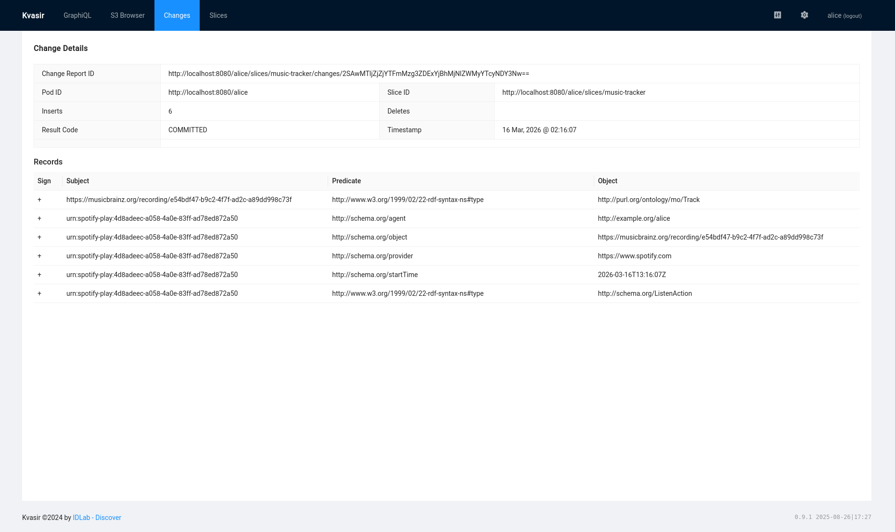
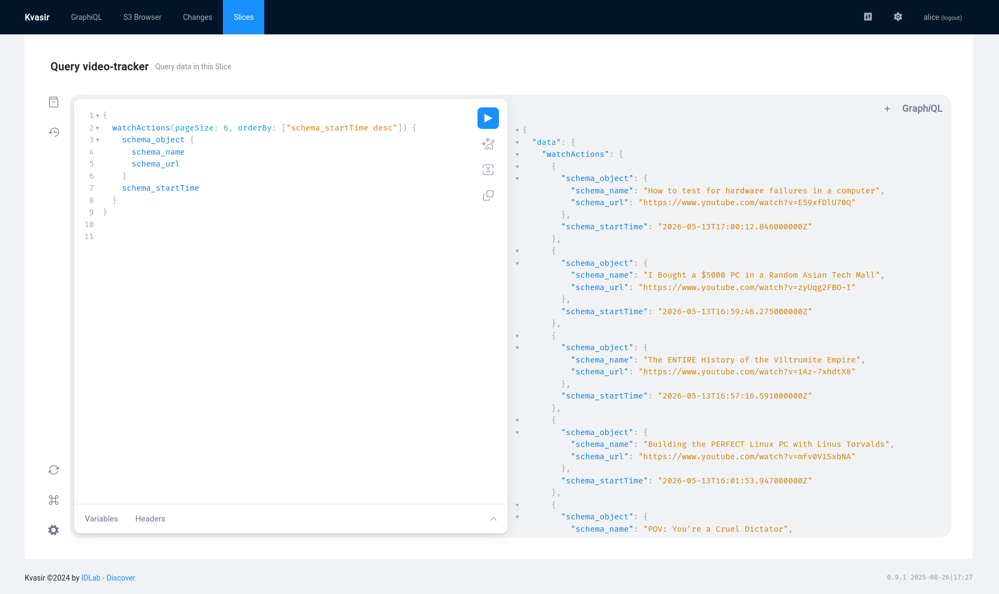

## Implementation
{:#implementation}

This chapter demonstrates the architecture described in the previous chapter through a concrete proof-of-concept. The prototype extends the kvasir-music-tracker example application published by imec-IDLab. That application provides a Spotify client, a Python change processor that fetches MusicBrainz metadata via SSE subscriptions, a basic Vue.js web application for browsing recently played tracks, and a Docker Compose environment preconfigured for a demo user alice. This thesis extends that foundation by adding a video-tracker slice and change processor, a cross-service profile slice, user-controlled identity linking between music and video creators, a local inference component, a significantly expanded web application, and a browser extension. The browser extension is an extension for Firefox that captures events directly from YouTube and SoundCloud. On YouTube it detects watch events via DOM observation and the `yt-navigate-finish` event. On SoundCloud it detects listen events by observing the player badge for track changes. Both content scripts relay events to a background script that forwards them to the pod as JSON-LD change requests. The Spotify client from the original demo remains functional alongside the extension, giving the prototype three independent event sources: Spotify, YouTube, and SoundCloud. The chapter walks through the complete data flow: from defining a slice schema and registering a pod, through writing a media event, to the enrichment and aggregation steps that produce the cross-service profile. Two slices are used throughout: `music-tracker` for listening behaviour and `video-tracker` for watch behaviour.

### 1. Define the Slice Schema

Each slice is defined by a GraphQL SDL schema. The schema declares which types are queryable, which mutations are available, and which subscriptions clients can open. Two vocabularies are combined in the music slice: schema.org for interactions and the Music Ontology for tracks, records, and groups.

The music tracker schema exposes four queryable types and a subscription that fires whenever a new listen event is written:

<figure id="lst-schema-music-tracker" class="listing">
<figcaption markdown="block">
GraphQL SDL schema for the `music-tracker` slice, combining schema.org and Music Ontology vocabularies. The `@generateMutations` directive auto-generates `add` mutations for every queryable type.
</figcaption>

````/code/schema-music-tracker.graphql````
</figure>

The `@generateMutations(operations: ["add"])` directive on the `Query` type instructs Kvasir to auto-generate `add` mutations for every queryable type. The `schema_InteractionCounter` type additionally carries `remove` to support the delete-then-insert counter update pattern used by the change processor.

The video tracker schema follows the same structure using schema.org throughout:

<figure id="lst-schema-video-tracker" class="listing">
<figcaption markdown="block">
GraphQL SDL schema for the `video-tracker` slice, using schema.org vocabulary throughout.
</figcaption>

````/code/schema-video-tracker.graphql````
</figure>

The cross-service profile slice introduces a `csp_Creator` type that holds aggregated interaction counts alongside confirmed cross-platform identity links:

<figure id="lst-schema-csp" class="listing">
<figcaption markdown="block">
GraphQL SDL schema for the `cross-service-profile` slice. The `schema_sameAs` field stores user-confirmed cross-platform identity links, `schema_interactionStatistic` accumulates counts across both music and video slices, and `csp_UserInsight` stores user-validated behavioural assertions.
</figcaption>

````/code/schema-csp.graphql````
</figure>

The `schema_sameAs` field links a music creator URI to a video creator URI once the user has confirmed the match. The `schema_interactionStatistic` field accumulates interaction counts aggregated across both the music and video slices.

### 2. Bootstrap the Pod and Register Slices

The pod for user `alice` is created automatically when Kvasir starts, using the bootstrap configuration in `kvasir-config/application.yaml`. The configuration sets a default JSON-LD context covering schema.org, Music Ontology, Dublin Core, and FOAF, and registers five Keycloak clients:

- `music-tracker`: a browser-facing client used by the web application
- `music-tracker-client`: a service account used by the change processor, with reader, writer, and deleter access to the `music-tracker` slice, writer access to the MinIO cover-art bucket, and writer and deleter access to the `cross-service-profile` slice for upserting creator entries
- `video-tracker`: a browser-facing client
- `video-tracker-client`: a service account with reader, writer, and deleter access to the `video-tracker` slice and writer and deleter access to the `cross-service-profile` slice
- `recommender-client`: a service account used by the inference service, with read-only access to the `cross-service-profile` slice

The OpenFGA relationships are declared inline in the bootstrap configuration:

<figure id="lst-bootstrap-openfga" class="listing">
<figcaption markdown="block">
Bootstrap configuration declaring OpenFGA relationships for `music-tracker-client`, granting read, write, and delete access to the `music-tracker` slice, write access to the MinIO cover-art bucket, and write and delete access to the `cross-service-profile` slice.
</figcaption>

````/code/bootstrap-openfga.txt````
</figure>

This means that when Kvasir starts, the pod, the clients, and all access-control relationships already exist, requiring no manual setup.

The slices themselves are registered by POSTing the SDL schema to the pod's `/slices` endpoint. On success Kvasir returns `201 Created` with the slice URL in the `Location` header.

### 3. Authenticate as a Service

All Python services authenticate using the OAuth 2.0 `client_credentials` flow. The service exchanges its `client_id` and `client_secret` for a bearer token from Keycloak, then attaches the token to every subsequent request. Kvasir validates the token and asks OpenFGA whether the token's subject has the required role on the target slice before executing the operation.

### 4. Write a Media Event

A media client writes a `ListenAction` or `WatchAction` by posting a JSON-LD delta to the slice's changes endpoint. Each event receives a deterministic URI constructed from the event type, content identifier, and timestamp:

```
urn:combine-ld:watch:<videoId>:<timestamp>
```

An example listen event for a MusicBrainz recording:

<figure id="lst-listen-event-jsonld" class="listing">
<figcaption markdown="block">
A `schema:ListenAction` event in JSON-LD format, linking a user agent to a MusicBrainz recording URI. The deterministic subject URI is derived from the event type, recording identifier, and timestamp.
</figcaption>

````/code/listen-event.jsonld````
</figure>

Because the URI is deterministic, re-importing the same event overwrites the existing triple rather than creating a duplicate. [](#fig-changes-music-tracker) shows the committed change report for one such event, displaying the six RDF triples written to the `music-tracker` slice.

<figure id="fig-changes-music-tracker">

<figcaption markdown="block">
A committed change report in Kvasir's Changes view for the `music-tracker` slice. The six inserted triples record the track as a `mo:Track` linked to its MusicBrainz URI, and the listen event as a `schema:ListenAction` with agent, object, provider, and timestamp. The deterministic subject URI follows the `urn:combine-ld:listen:` pattern.
</figcaption>
</figure>

### 5. The Change Processor Reacts

When the event reaches Kvasir, it is committed to ClickHouse and a change message is published to the Redpanda topic for the `music-tracker` slice. The change processor, which holds an open SSE subscription on `onListenActionAdded`, receives the event and begins enrichment.

The processor extracts the MusicBrainz recording ID from the track URI and calls the MusicBrainz API to retrieve the full release metadata: artist credits, album title, release date, track listing, and release group. It then:

1. Fetches the album cover art and stores it in the MinIO bucket if it does not already exist, storing the resulting S3 URI as `foaf:depiction` on the release group.
2. Fetches an artist thumbnail from the Wikipedia API and stores it as `foaf:depiction` on the artist.
3. Writes the enriched track, album, and artist objects back to the slice via change requests.
4. Updates the play counters for the track, album, and all credited artists.

### 6. Update Counters with Delete-Then-Insert

Play and watch counts are stored as `schema:InteractionCounter` triples attached to each track, album, artist, video, or channel. Because RDF triples cannot be incremented in place, the processor uses a delete-then-insert pattern driven by a `with`-clause that first reads the current counter value:

<figure id="lst-delete-then-insert" class="listing">
<figcaption markdown="block">
Delete-then-insert pattern for updating `schema:InteractionCounter` triples. The `with`-clause reads the current count before the delete and insert operations are executed.
</figcaption>

````/code/delete-then-insert.txt````
</figure>

The same pattern is used by the watch processor for video and channel watch counts.

One consequence of using SSE subscriptions is that they deliver only events written after the subscription was opened. If the processor was not running when a batch of events was imported, those events are invisible to it. In the prototype, clearing the ClickHouse storage while the processor was offline caused the cross-service profile to become empty. New events subsequently produced correct profiles, but the historical behaviour was absent until a manual backfill was run.

### 7. Query the Enriched Profile

After the change processor has committed the enrichment, the slice can be queried for the aggregated profile. For example, to retrieve the top-played artists:

<figure id="lst-query-artists" class="listing">
<figcaption markdown="block">
GraphQL query against the `music-tracker` slice returning all artists ordered by interaction count, including their name, depiction, and aggregated play count.
</figcaption>

````/code/query-artists.graphql````
</figure>

The recommender reads aggregated creator data from the cross-service profile, constructs a prompt from the most-watched channels and most-listened artists, and sends that prompt to Ollama for inference, keeping all profile data within the local environment at all times. [](#fig-query-video-tracker) shows a live query against the `video-tracker` slice, demonstrating that recent watch events are stored and retrievable through the GraphQL interface.

<figure id="fig-query-video-tracker">

<figcaption markdown="block">
A GraphQL query against the `video-tracker` slice returning the six most recent watch events with video title, URL, and timestamp. The query is executed through Kvasir's built-in GraphiQL interface, authenticated as user `alice`.
</figcaption>
</figure>

### 8. Cross-Service Identity Linking

The web application includes a "Link Profiles" view where users can review and confirm fuzzy identity matches between music creators and video creators. The matching heuristic compares creator names from the `music-tracker` and `video-tracker` slices. When names are similar enough, a suggested link is surfaced in the UI.

When a user confirms a match, the application writes a `schema:sameAs` triple to the `cross-service profile` slice, linking the music creator URI to the corresponding video creator URI. The pod thereby becomes the authoritative source of cross-platform identity rather than the heuristic matcher.

A separate "Unified" view reads these confirmed `schema:sameAs` links to display cross-platform activity. It combines aggregated listening and viewing counts for creators whose identity has been explicitly verified by the user, joining data from both slices through the user-authored link.

One practical detail affects name-based matching. Some music platforms return comma-separated multi-artist strings, for example "Kanye West, Ye, Andre Troutman" for a collaborative track. The prototype captures only the primary artist name to ensure stable matching. Full multi-artist attribution is retained in the track metadata, but only the first credited artist contributes to the identity link candidate list.

The prototype implements automatic identity resolution via Wikidata's public SPARQL endpoint. When the change processor handles a SoundCloud or MusicBrainz listen event, it queries Wikidata using the SoundCloud slug (P3040) or MusicBrainz artist ID (P434) to retrieve the corresponding YouTube channel ID (P2397). The watch processor performs the reverse: a YouTube channel ID is used to look up its SoundCloud slug. When a match is found, `schema:sameAs` is written automatically without user intervention, and `schema:isBasedOn` stores the Wikidata entity URI as provenance. The UI distinguishes Wikidata-verified links from user-confirmed ones through separate visual indicators. User confirmation remains the fallback for creators not present in Wikidata.

One limitation remains: creator identity links are stored per user. Two users observing the same cross-platform identity would each hold an independent copy. For well-known public creators this is mitigated by Wikidata resolution, which produces identical links for all users. For obscure creators, the per-user model reflects that cross-platform identity is genuinely a personal assertion rather than a shared fact.

### 10. User-Validated Behavioural Insights

The system includes a feedback loop that grounds personalisation in explicit user validation. The inference service generates behavioural hypotheses from the aggregated cross-service profile, surfaces them as questions in the web application, and stores the user's validated answers as RDF in the pod. These stored answers are incorporated into subsequent recommendation prompts, allowing the profile to accumulate user-authored assertions alongside passively collected interaction data.

**Insight generation.** The `/insights` endpoint of the inference service queries the `cross-service-profile` slice for the top-watched video channels and most-listened music artists, and computes a set of context metrics: the number of creators active on each platform, the share of total activity concentrated in the top three creators, and the set of creators with confirmed cross-platform identity links. These signals are assembled into a structured prompt sent to Ollama, which returns a JSON array of insight objects. Each object contains a statement (a behavioural claim phrased declaratively, for example "You primarily watch technology content") and a question (a yes/no reformulation presented to the user).

**Storing validated answers.** When the user responds, the web application posts the question, the answer text, and a status value to the `/insights/answer` endpoint. The endpoint writes a `csp:UserInsight` node to the `cross-service-profile` slice via a JSON-LD change request. The `schema:actionStatus` field distinguishes three cases: `confirmed` (the user agreed with the claim), `denied` (the user rejected it), and `corrected` (the user provided an alternative). The write uses the `video-tracker-client` service account, which holds writer access to `cross-service-profile`. The `csp_UserInsight` type is defined in the updated `cross-service-profile` SDL shown in [](#lst-schema-csp).

**Feeding back into recommendations.** Both recommendation endpoints retrieve stored insights before constructing the prompt. Confirmed insights are presented as established user preferences. Denied insights are explicitly marked as claims the user has rejected, preventing the model from reproducing them in subsequent sessions. Corrected insights present the original assumption alongside the user's correction. This allows the model to reason from a user-validated profile rather than inferred behaviour alone, and prevents the same incorrect assumption from recurring across sessions.

### Import Rate Limiting

The initial data import sent five concurrent requests per batch with no delay between batches. At 42,000 records this produced approximately 8,400 batches in under a minute, far exceeding Kvasir's processing capacity of around 66 records per second. The result was a flooded Kafka topic and a backlog that Kvasir could not clear in time.

The fix was to add a 150-millisecond pause between batches. This reduces the effective ingestion rate to approximately 33 records per second, comfortably below Kvasir's capacity and leaving headroom for other operations during import.

A side effect of the original flood was that resetting the Kafka consumer offset to recover from the crash caused approximately 29,000 queued messages to be skipped. Only 13,044 of the original 42,000 records reached ClickHouse. Because each record uses a deterministic URI as its RDF subject identifier, the import can be re-run safely without producing duplicates: records already present in ClickHouse are overwritten with identical data, while missing records are inserted fresh.