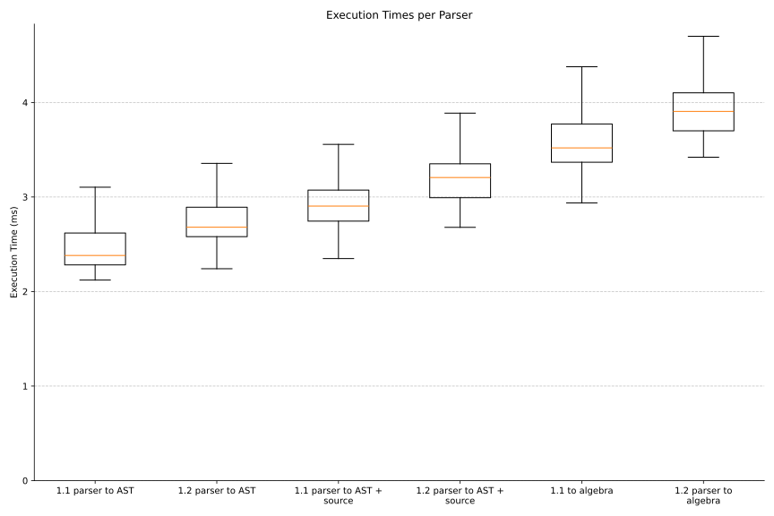
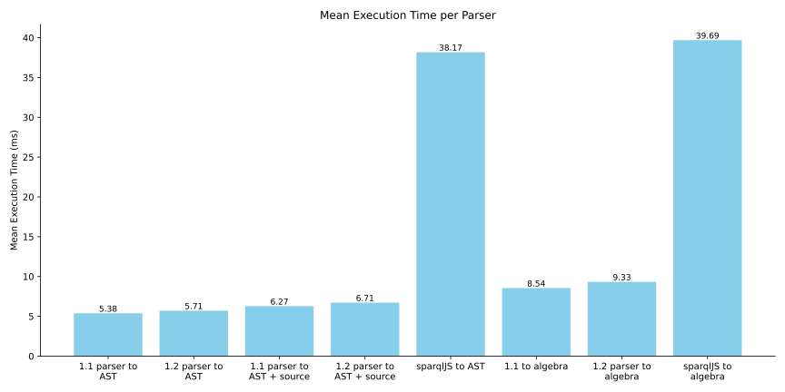

## Performance analysis
{:#perf}

While the primary focus of Traqula is flexibility and expressivity,
sufficient performance is still important in broadly used software tools.
As such, we evaluate the execution-time performance of Traqula, comparing its different parsing modes,
contrasting it with the [SPARQL.js](cite:cites sparqljs) parser plus the algebra transformation software [SPARQLAlgebra.js](cite:cites sparqlalgebrajs),
and highlighting the impact of parser reuse.
All measurements were conducted on Fedora Linux 43 (Workstation Edition), equipped with an Intel® Core™ Ultra 7 165U × 14 processor, having 16 GiB of RAM.
We measured the execution times of parsing [50 real-world SPARQL 1.1 queries](cite:cites dbpedia-bench) in each of the tools and
[provide the scripts for reproducibility](https://github.com/comunica/traqula/tree/test/more-bench/eval){:.mandatory}.

 shows the execution times of Traqula across different targets and parser configurations.
Patching a modular SPARQL 1.1 parser to support SPARQL 1.2 results in a small but statistically significant increase in execution time (p < 0.05),
with a mean increase of 10.8% <!-- 2.77/2.5 -->.
Tracking source information to support round-tripping introduces additional overhead due to the more complex lexing process,
with mean increases of  18.8% <!-- 2.97/2.5 -->
and 16.6% <!-- 3.23/2.77 --> for SPARQL 1.1 and 1.2 parsing, respectively (both p < 0.05).
Parsing directly into algebra, effectively performing an AST transformation after parsing, further increases execution time,
with mean increases of 45.6% <!-- 3.64/2.5 --> for SPARQL 1.1 and 43.0% <!-- 3.96/2.77 --> for SPARQL 1.2 (p < 0.05).

Despite these relative increases,  shows Traqula remains substantially faster than existing solutions.
The mean execution time for parsing into an AST using Traqula is 2.5 ms, compared to 23.93 ms for SPARQL.js, a 957.2% difference,
even though Traqula generates a more complete and correct AST.
Parsing into algebra shows a similar trend: Traqula takes 3.64 ms, while SPARQLAlgebra.js (using SPARQL.js) requires 24.04 ms, a 660.4% difference.
Much of this advantage can be attributed to the performance of Chevrotain, the parser toolkit underlying Traqula.

<figure id="traqula-bench">

<figcaption markdown="block">
Variance of execution times (ms) for Traqula's SPARQL 1.1 and 1.2 parsers,
when parsing [50 real world SPARQL 1.1 queries](cite:cites dbpedia-bench) using different configurations.
Parsing SPARQL 1.2 is always slightly slower than parsing SPARQL 1.1 due to increased grammar complexity,
and source tracking or algebra transformation further increase effort.
</figcaption>
</figure>

<figure id="traqula-bench">

<figcaption markdown="block">
Execution time (ms) comparison between Traqula and the
[SPARQL.js](cite:cites sparqljs) parser plus the algebra transformation software [SPARQLAlgebra.js](cite:cites sparqlalgebrajs)
when parsing [50 real-world SPARQL 1.1 queries](cite:cites dbpedia-bench).
Parsing to both an AST (green) and to algebra (orange) is significantly faster using Traqula.
</figcaption>
</figure>

Finally, it is important to recognise the cost associated with using a parser toolkit in a non-pre-compiled language like TypeScript.
Traqula's underlying parser toolkit, Chevrotain, performs its parser optimizations at runtime, making parser construction computationally expensive. 
To illustrate, parsing the 50 queries with a prebuilt and reused parser has a mean execution time of 2.5 ms,
whereas creating a new parser for each query results in a mean execution time of 689.31 ms; a slowdown of 275.7 times.
Moreover, because Chevrotain is optimised for JavaScript’s V8 engine, many performance benefits rely on JIT compilation.
Recreating the parser repeatedly may prevent or invalidate JIT optimizations, further degrading performance.
This makes parser reuse essential in practice, as already adopted in systems such as the Comunica query engine.
