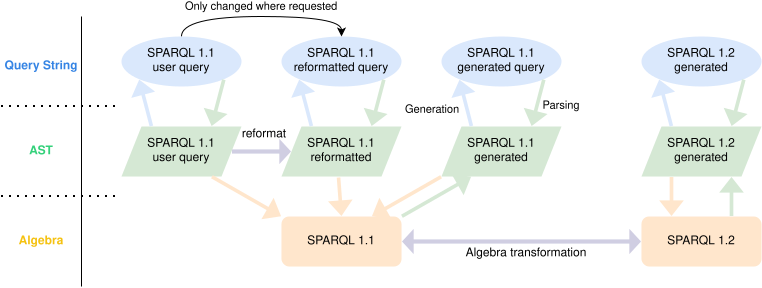

## Introduction
{:#introduction}

<!--
Talk about generation, modularity, you can refer to self about parsers but say that we have gone much more broad now.
We support round-tripping, generation, and algebra transformation.
Additional pro for in language parser builder is the variation your get from the type system.
Round-tripping allows you to make language tools such as linters.
AST transformer.
Why JS/ TS?
Modularity allows future proofness.
Why is do you see this issue in sparql? separation between the data model and query language?
What parsers do we support ourselves? Link to the proof of extension we did in Comunica?
-->

The [SPARQL query language](cite:cites spec:sparqllang) is the de facto standard to query [RDF](cite:cites spec:rdf) data.
Recent work shows that many SPARQL dialects exist, covering different extensions or limitations related to the standard,
and projects this practical heterogeneity to increase as the RDF 1.2 working group enters its
[maintenance mode](https://github.com/w3c/sparql-dev/issues/32#issuecomment-2621209920) .
Virtuoso extends SPARQL with full-text search capabilities ,
Apache Jena adds support for constructing quads ,
and Oxigraph provides an additional built-in function, `adjust` .
Furthermore, some query engines/ [SPARQL endpoints](cite:cites spec:sparqlprot) might limit the SPARQL language as
to remove known expensive operators such as OPTIONAL .
<!-- -->
The diversity between the different SPARQL versions and dialects poses various challenges:

1. **Query evaluation**: A user query written in one version might not be executable on a SPARQL engine supporting another version.
2. **Tooling**: Linters, formatters, and editors expect queries to be written in a certain version.
3. **Tooling maintainability**: tools that do support multiple versions typically do so by maintaining multiple versions,
   or one version with many conditions, making maintainability a nightmare.

To tackle these issues, previous work introduced the idea of a modular parser but did not create a full implementation .
Their idea is essentially to introduce an indirection layer in your grammar definitions,
meaning that the declaration of a rule, consisting of subrules and tokens, is done based on identifiers of the rules.
The identifiers of those rules are only replaced with the actual implementation of the rules when you compile/ build the parser.
By cleverly defining an API that links rule identifiers with rule implementations, one creates a composable parser.
A parser only gets you the Abstract Syntax Tree (AST) or Concrete Syntax Tree (CST) ,
while query engines operate on a higher level, namely the [SPARQL Algebra](cite:cites spec:sparqllang),
so additional transformations are required after parsing.
The SPARQL specification describes how to translate the AST into these algebraic operations.
Query evaluation and optimization rely on the manipulation of these algebraic operations,
and [SPARQL federation](cite:cites spec:sparqlfed) relies on the conversion of algebra operations to query strings.
For that reason, we also need a way to translate the algebra operations back into an AST,
which can then be used to generate the appropriate query string.
All these conversions suffer from the same problems caused by the practical heterogeneity of SPARQL.

Since SPARQL queries are structured languages often created or read by humans, similar to programming languages,
it makes sense that they benefit from similar tools such as editors, code highlighting, linters, and reformatting.
Some of these tools rely on a property called round tripping, meaning you can convert the query string into an AST,
perform changes to a node, and the conversion back only changes that changed node, keeping everything else the same.
An example of reformatting would be the expansion of the variable _'s'_ to _'subject'_ in `SelECT_*_{_?s__?p_?o_}`
without changing other parts of the query.
Such an expansion would result in `SelECT_*_{_?subject__?p_?o_}`.
 provides a schematic overview of these different representations of a query.

<figure id="representations">

<figcaption markdown="block">
Schematic representation of various representations of an algebraically equivalent SPARQL 1.1 query and a transformation to a 1.2 query.
A query can be represented as structured language that both end-users and SPARQL endpoints use.
Parsing that representation provides you with the AST representation, which is a structured representation of the language used by linters and formatters.
The AST can be transformed to an algebra representation, which is used by query engines; it provides a higher level of abstraction than the AST.
Transformations exist within the layer, and the choice of what layer to transform in is based on the level of precision or abstraction required. 
</figcaption>
</figure>

To handle the heterogeneity of SPARQL,
which is projected to only increase with the adoption of [RDF 1.2](cite:cites rdf-1-2) and the [subsequent maintenance mode](https://github.com/w3c/sparql-dev/issues/32#issuecomment-2621209920) of the RDF 1.2 workgroup .
There is a need for a modular SPARQL parser, generator, and algebra transformation toolkit.
In this paper we introduce _Traqula_, a modular toolkit that already supports [SPARQL 1.1](cite:cites spec:sparqllang) and [SPARQL 1.2](cite:cites sparql-1-2).
Traqula aims to allow researchers and practitioners to:

1. investigate the effect of making grammar changes (adding, modifying, or deleting grammar rules),
2. increase maintainability of language tools, including the parsers, generator, and algebra transformers across different SPARQL versions, and
3. open the path for future query formatting/ rewriting tools based on round-tripping.

Traqula is implemented in the TypeScript programming language,
and can also be used in JavaScript/ECMAScript,
both using the CommonJS (CJS, legacy) format and ECMAScript Modules (ESM, modern) format.
Traqula, and its various components are publicly available on GitHub and the npm package manager
under the open-source MIT software license.

The next section.... 

<!--
Translation between versions
Allow to test certain language features,
Allow to disable certain language features,
allow maintainability of tools,
allow future implementation of editor that supports rewriting
Modularity also allows introduction of quality of life improvements (see helpers in generator.)
-->
<!--
the authors recently made a [Proof of Concept](cite:cites modular-parsing) on how a **modular parser** could solve issues arising form such a heterogeneous SPARQL landscape.
After positive reactions on that PoC, we extended our work to be
more mature, include modular round-tripping parsers and generators, and modular algebra transformers,
allowing us to present Traqula: a collection of modular parsers, generators and algebra transformers. 
-->
<!--
At the core of the Semantic Web is [the resource Description Framework (RDF)](cite:cites spec:rdf),
which is described as an abstract syntax/ data-model, that ties together multiple other specification such as:
1. [RDF Semantics](cite:cites spec:rdf-semantics);
2. various syntaxes such as [n-triple](cite:cites spec:n-triples), [turtle](cite:cites spec:turtle) and [json-ld](cite:cites spec:json-ld);
3. the [RDF schema vocabulary](cite:cites spec:rdf-schema); and
4. a collection of specification describing the RDF Query Language, SPARQL, like
[SPARQL Query Language](cite:cites spec:sparqllang) and [SPARQL Update](cite:cites spec:sparqlupdatelang).
RDF and it's accompanying specification know multiple versions,
namely [RDF 1.0](cite:cites spec:rdf-1-0), [RDF 1.1](cite:cites spec:rdf), and the upcoming [RDF 1.2](cite:cites rdf-1-2).
-->
<!--
The RDF data model is tightly interconnected with the web,
due to its dependence on IRIs as first class citizens, serving the notion of persistent identifiers.
The existence of persistent identifiers allows for a seamless merge operation between two datasets,
since an IRI used in both datasets identifies the same concept/ resource .
In turn, this seamless merging of different datasets makes [SPARQL federated queries](cite:cites spec:sparqlfed) specifically interesting.
-->
<!--
Each of those versions thus has their accompanying SPARQL version, [1.0](cite:cites spec:sparql-1-0), [1.1](cite:cites spec:sparqllang), and [1.2](cite:cites sparql-1-2).
-->

